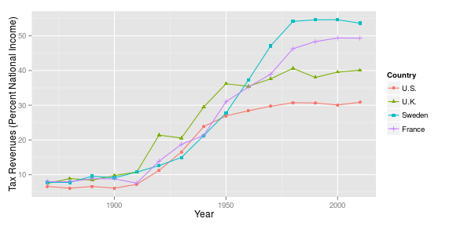
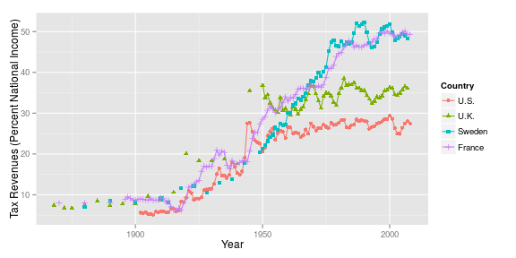

Capital in the 21st Century: Chapter 13
========================================================
 
### Data provenance
 
The data were downloaded as Excel files from: http://piketty.pse.ens.fr/en/capital21c2. 
 
### Loading relevant libraries and data
 
This document depends on the [xlsx](http://cran.r-project.org/web/packages/xlsx/index.html), [reshape2](http://cran.r-project.org/web/packages/reshape2/index.html), and [ggplot2](http://cran.r-project.org/web/packages/ggplot2/index.html) packages.
 
 

 


## Make Figure 13.1
ggplot(data=ts131m, aes(x=Decade,y=TaxRevenuesPercents,colour=Country),xlim=c(1870,2010)) + 
  xlab("Year") + 
  ylab("Tax Revenues (Percent National Income)") +
  geom_line() + 
  geom_point(aes(shape=Country))


 
<!--
## below is the qplot way to do it, quick dirty.  up above
## may allow more customization
## qplot(Decade,TaxRevenuesPercents,data=ts131m, color=Country,geom="line",xlim=c(1870,2010),xlab="Year",ylab="Tax Revenues (Percent National Income)")
-->
 
Now there is a table to the side, that's not summarized into decades...let's see where this goes...
 


## Table TS13.1x, where x = extra
ts131x = read.xlsx("../_data/Chapter13TablesFigures.xlsx",sheetName="TS13.1",rowIndex=5:146,colIndex=7:11,header=TRUE)
names(ts131x) = c("Year", "U.S.", "U.K.", "Sweden", "France")
ts131xm = melt(ts131x,id.vars="Year")
names(ts131xm) = c("Year","Country","TaxRevenues")
ts131xm$TaxRevenuesPercents <- ts131xm$TaxRevenues*100

 
 


## Make Figure 13.1x
ggplot(data=ts131xm, aes(x=Year,y=TaxRevenuesPercents,colour=Country),xlim=c(1870,2010)) + 
  xlab("Year") + 
  ylab("Tax Revenues (Percent National Income)") +
  geom_line() + 
  geom_point(aes(shape=Country))



## Warning: Removed 50 rows containing missing values (geom_path).



## Warning: Removed 196 rows containing missing values (geom_point).


 
 
<!--
## below is the qplot way to do it, quick dirty.  up above
## may allow more customization
##qplot(Year,TaxRevenuesPercents,data=ts131xm, color=Country,geom="line",xlim=c(1870,2010),xlab="Year",ylab="Tax Revenues (Percent National Income)")
 
 
 
## prettify above, edit below.
## items remaining -- the table 13.2, for which there was no included figure(s).
-->
