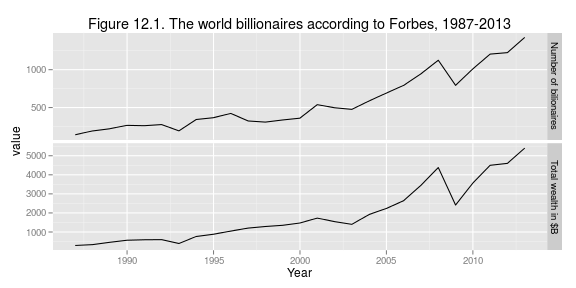
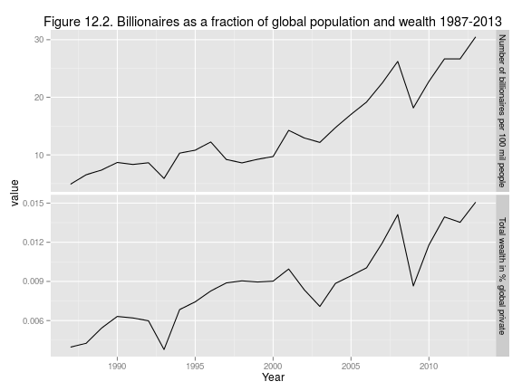
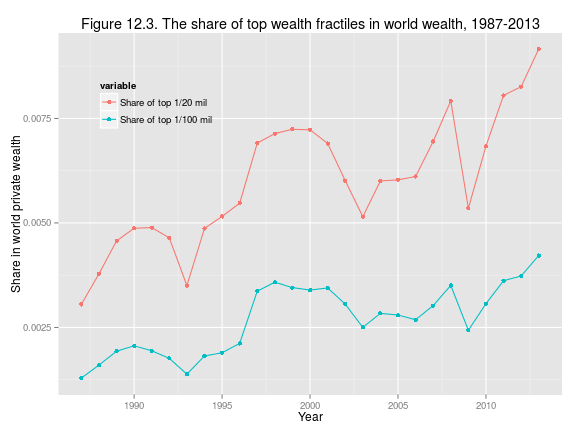
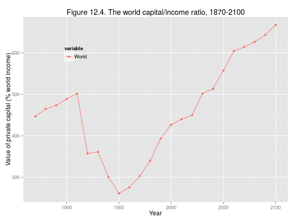
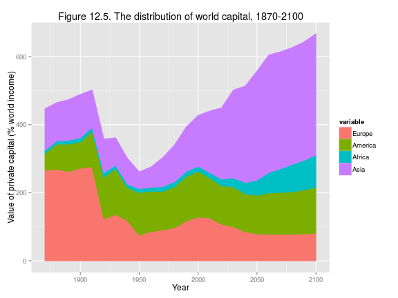
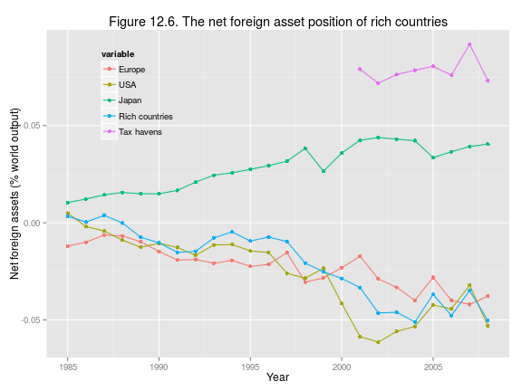

Capital in the 21st Century: Chapter 12
========================================================
 
### Data provenance
 
The data were downloaded as Excel files from: http://piketty.pse.ens.fr/en/capital21c2. 
 
### Loading relevant libraries and data
 
This document depends on the [xlsx](http://cran.r-project.org/web/packages/xlsx/index.html), [reshape2](http://cran.r-project.org/web/packages/reshape2/index.html), and [ggplot2](http://cran.r-project.org/web/packages/ggplot2/index.html) packages.
 
 

 


## Make Figure 12.1
fig12.1 <- subset(ts12.3m, variable %in% 
  c("Number of bilionaires", "Total wealth in $B"))
fig12.1$variable <- as.character(fig12.1$variable)
fig12.1a <- fig12.1[fig12.1$variable == "Number of bilionaires", ]
fig12.1b <- fig12.1[fig12.1$variable == "Total wealth in $B", ]
p <- ggplot(data = fig12.1, mapping = aes(x = Year, y = value))
p <- p + facet_grid(variable~., scale="free")
p <- p + layer(data= fig12.1a, geom = c("line", "point"), stat = "identity")
p <- p + layer(data= fig12.1b, geom = c("line", "point"), stat = "identity")
p + ggtitle("Figure 12.1. The world billionaires according to Forbes, 1987-2013")


 
 


## Make Figure 12.2
 
fig12.2 <- subset(ts12.3m, variable %in% 
  c("Total wealth in % global private",
    "Number of billionaires per 100 mil people"))
fig12.2$variable <- as.character(fig12.2$variable)
fig12.2a <- fig12.2[fig12.2$variable == "Total wealth in % global private", ]
fig12.2b <- fig12.2[fig12.2$variable == "Number of billionaires per 100 mil people", ]
p <- ggplot(data = fig12.2, mapping = aes(x = Year, y = value))
p <- p + facet_grid(variable~., scale="free")
p <- p + layer(data= fig12.2a, geom = c("line", "point"), stat = "identity")
p <- p + layer(data= fig12.2b, geom = c("line", "point"), stat = "identity")
p + ggtitle("Figure 12.2. Billionaires as a fraction of global population and wealth 1987-2013")


 


## Make Figure 12.3
qplot(Year, value, data=subset(ts12.3m, variable %in% 
  c("Share of top 1/20 mil", "Share of top 1/100 mil")),
  geom=c("line", "point"),
  color=variable, xlab = "Year", ylab= "Share in world private wealth") +
  xlim(1987,2013) +
  theme(legend.position=c(0.2, 0.8),
        legend.background = element_rect(fill="transparent")) +
  ggtitle("Figure 12.3. The share of top wealth fractiles in world wealth, 1987-2013")


 
 


## Make Figure 12.4
qplot(Year, value * 100, data=subset(ts12.4m, variable == "World"),
  geom=c("line", "point"),
  color=variable, xlab = "Year", 
ylab= "Value of private capital (% world income)") +
  xlim(1870,2100) +
  theme(legend.position=c(0.2, 0.8),
        legend.background = element_rect(fill="transparent")) +
  ggtitle("Figure 12.4. The world capital/income ratio, 1870-2100")


 
 


## Make Figure 12.5
qplot(Year, value * 100, data=subset(ts12.4m, variable != "World"),
  geom="ribbon",  fill=variable, position="stack",
  color=variable, xlab = "Year",
  ylab= "Value of private capital (% world income)") +
  ggtitle("Figure 12.5. The distribution of world capital, 1870-2100")



## ymax not defined: adjusting position using y instead


 
 


## Make Figure 12.6
qplot(Year, value, data=ts12.5m,
   geom=c("line", "point"),
  color=variable, xlab = "Year",
  ylab= "Net foreign assets (% world output)") +
  xlim(1985,2008) +
  theme(legend.position=c(0.2, 0.8),
        legend.background = element_rect(fill="transparent")) +
  ggtitle("Figure 12.6. The net foreign asset position of rich countries")



## Warning: Removed 16 rows containing missing values (geom_path).



## Warning: Removed 16 rows containing missing values (geom_point).


 
