Capital in the 21st Century: Chapter 11
========================================================
 
### Data provenance
 
The data were downloaded as Excel files from: http://piketty.pse.ens.fr/en/capital21c2
 
### Loading relevant libraries and data
 
This document depends on the [xlsx](http://cran.r-project.org/web/packages/xlsx/index.html),
[reshape2](http://cran.r-project.org/web/packages/reshape2/index.html), 
[scales](http://cran.r-project.org/web/packages/scales/index.html),
[plyr](http://cran.r-project.org/web/packages/ggplot2/index.html) packages.
 


library(ggplot2)
library(xlsx)
library(reshape2)
library(scales)

 
## Figures 11.1 - 11.12 The age-wealth profile in France
 
All figures from Table T11.1
 


ts11 <- read.xlsx("../_data//Chapter11TablesFigures.xlsx", sheetName="TS11.1", rowIndex=8:39, colIndex=c(1:13, 16:24), header=FALSE)
names(ts11) <- c("year", "Economic flow", "Fiscal flow",
                       "Economic Flows", "Fiscal Flows", 
                       "Adult Mortality", "Average death age", 
                       "Average age inheritors", "μ ratio Avg wealth",
                       "μ ratio corrected", "Annual inheritance flows",
                       "Simulated inheritance 1", "Simulated inheritance 2",
                       "Inheritance share Scenario 1", "Inheritance % labor resources Scenario 1",
                       "Living standard top 1% inheritance Scenario 1",
                       "Living standard top 1% labor earners Scenario 1",
                       "Cohort fraction Scenario 1",
                        "Inheritance share Scenario 2", "Inheritance % labor resources Scenario 2",
                       "Living standard top 1% inheritance Scenario 2",
                       "Cohort fraction Scenario 2")
ts11.melted <- melt(ts11, id.var="year")
 
qplot(year, value, data=subset(ts11.melted, variable %in% 
                                 c("Economic flow", "Fiscal flow")),
      geom=c("line", "point"), color=variable, xlab="Year",
      ylab="Annual value of inheritance and gifts (% national income)") +
  xlim(1820, 2020) +
  ggtitle("Figure 11.1. The annual inheritance flow as a fraction of national income, France 1820-2010")


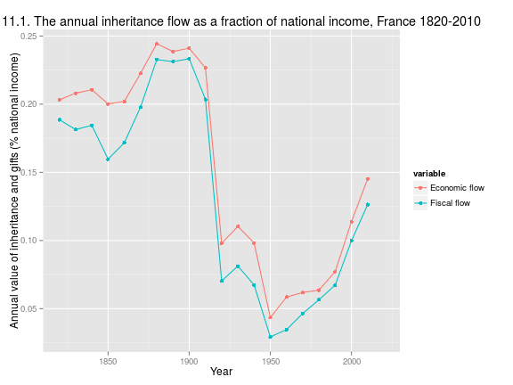 


qplot(year, value * 100, data=subset(ts11.melted, variable == "Adult Mortality"),
      geom=c("line", "point"), color=variable,
      xlab = "The mortality rate fell in France during the 20th century (rise of life expectancy), \n and should increase somewhat during the 21st century (baby-boom effect). ", ylab= "Adult mortality rate (%)") +
  xlim(1820,2100) + 
  ggtitle("Figure 11.2. The mortality rate in France 1820-2100")


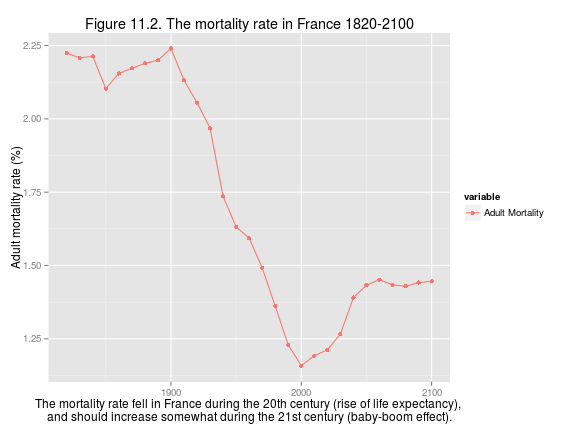 


  theme(legend.position=c(0.6, 0.8),
  legend.background = element_rect(fill="transparent"))



## List of 2
##  $ legend.position  : num [1:2] 0.6 0.8
##  $ legend.background:List of 4
##   ..$ fill    : chr "transparent"
##   ..$ colour  : NULL
##   ..$ size    : NULL
##   ..$ linetype: NULL
##   ..- attr(*, "class")= chr [1:2] "element_rect" "element"
##  - attr(*, "class")= chr [1:2] "theme" "gg"
##  - attr(*, "complete")= logi FALSE



qplot(year, value, data=subset(ts11.melted, variable %in% 
  c("Average death age", "Average age inheritors")), geom=c("line", "point"),
  color=variable, xlab = "Year", ylab= "Average age in years") +
  xlim(1820,2100) +
  theme(legend.position=c(0.2, 0.8),
        legend.background = element_rect(fill="transparent")) +
  ggtitle("Figure 11.3. Average age of decedents and inheritors, France 1820-2100")


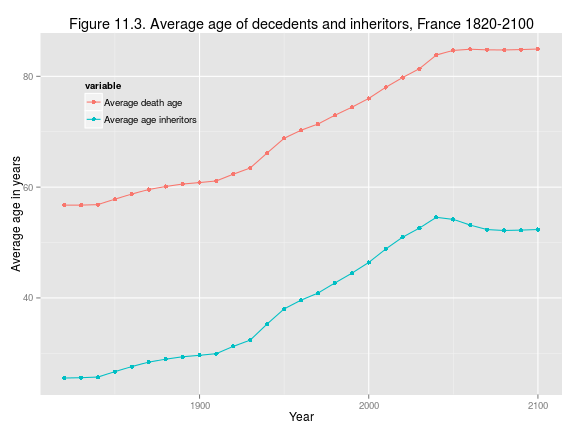 


qplot(year, value * 100, data=subset(ts11.melted, variable %in%
            c("Annual inheritance flows", "Adult Mortality")),
  geom=c("line", "point"), color=variable, xlab = "Year",
  ylab= "Annual rate of transmission or mortality (%)") +
  xlim(1820,2010) +
  theme(legend.position=c(0.7, 0.8),
        legend.background = element_rect(fill="transparent")) +
  ggtitle("Figure 11.4. Inheritance flow vs. mortality rate \n
          France 1820-2010")


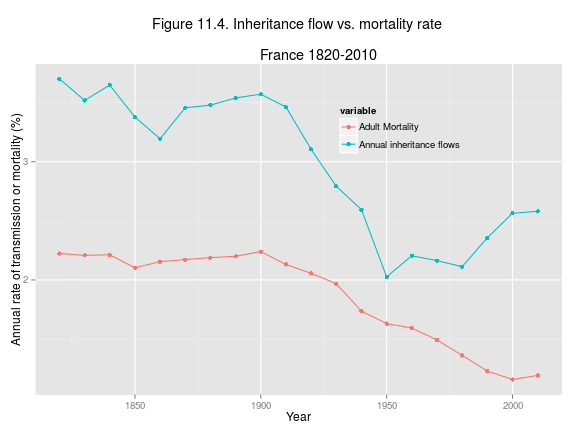 


qplot(year, value * 100, data=subset(ts11.melted, variable %in% 
            c("μ ratio Avg wealth", "μ ratio corrected")),
  geom=c("line", "point"), color=variable,
  xlab = "Year",
  ylab= "Ratio between the average wealth of decedents and the living") +
  xlim(1820,2010) +
  theme(legend.position=c(0.7, 0.8),
        legend.background = element_rect(fill="transparent")) +
  ggtitle("Figure 11.5. The ratio between average wealth at death \n
          and average wealth of the living, France 1820-2010")


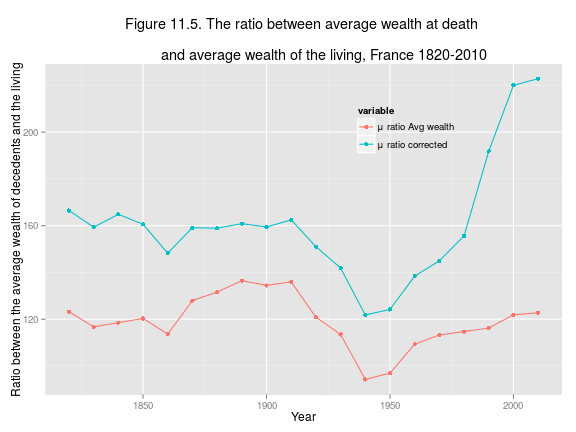 


qplot(year, value * 100, data=subset(ts11.melted, variable %in%
            c("Simulated inheritance 1", "Simulated inheritance 2", "Economic flow")),
  geom=c("line", "point"), color=variable, xlab = "Year",
  ylab= "Annual value of bequest and  gift (% national income)") +
  xlim(1820,2100) +
  theme(legend.position=c(0.6, 0.8),
        legend.background = element_rect(fill="transparent")) +
  ggtitle("Figure 11.6. Observed and simulated inheritance flow, France 1820-2100")


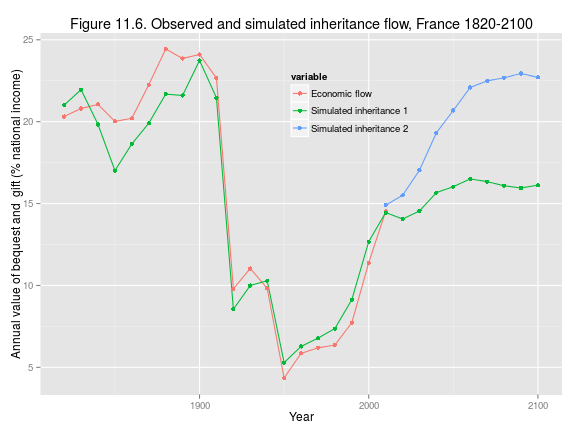 
 


ts11.2 <- read.xlsx("../_data//Chapter11TablesFigures.xlsx", sheetName="TS11.2", rowIndex=9:34,
                          colIndex=c(1:9, 11), header=FALSE)
 
names(ts11.2) <- c("year", "Share of wealth Scenario 1",
                         "Share of wealth Scenario 2",
                         "Share of capitalized wealth KS1 Scenario 1",
                         "Share of capitalized wealth KS1 Scenario 2",
                         "Share of capitalized wealth KS1 Scenario 1 ror",
                         "Share of capitalized wealth KS1 Scenario 2 ror",
                         "Share of capitalized wealth KS1 estimate Scenario 1",
                         "Share of capitalized wealth KS1 estimate Scenario 2",
                         "Gap PPVR")
 
ts11.2melted <- melt(ts11.2, id.var="year")
 
#Figure 7 uses data out on its own
fig7.ts11.1 <- ts11.2melted[ts11.2melted$variable == "Share of capitalized wealth KS1 estimate Scenario 1",]
fig7.ts11.2 <- read.xlsx("../_data//Chapter11TablesFigures.xlsx", sheetName="TS11.2", rowIndex=30:37,
                          colIndex=24, header=FALSE)
 
names(fig7.ts11.2) <- c("value")
fig7.ts11.2$variable <- "Share of inherited wealth (2010-2100L g=1,0%, r=5,0%)"
fig7.ts11.2 <- cbind(tail(fig7.ts11.1$year, n=nrow(fig7.ts11.2)), fig7.ts11.2)
names(fig7.ts11.2)[1] <- "year"
 
fig7.ts11.2.stacked <- rbind(fig7.ts11.1, fig7.ts11.2)

 
 
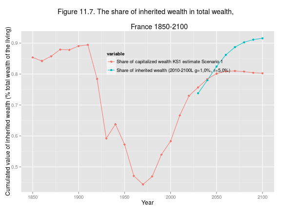 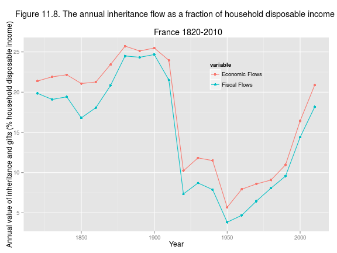 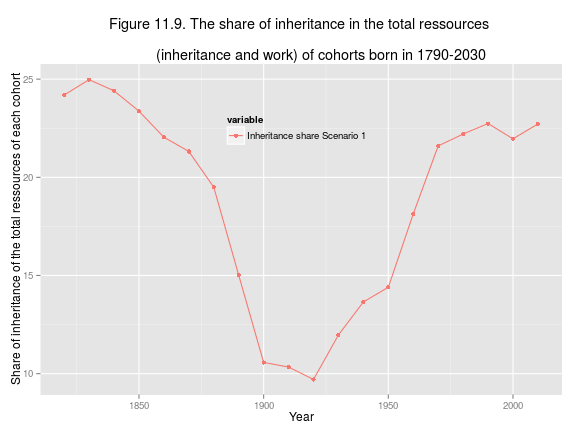 
 


qplot(year, value * 100, data=subset(ts11.melted, variable %in%
            c("Living standard top 1% inheritance Scenario 1",
                       "Living standard top 1% labor earners Scenario 1")),
  geom=c("line", "point"), color=variable, xlab = "Year",
  ylab= "Multiples of average income attained by bottom 50% wage earners") +
  xlim(1790,2030) +
  theme(legend.position=c(0.7, 0.8),
        legend.background = element_rect(fill="transparent")) +
  ggtitle("Figure 11.10. The dilemma of Rastignac \n
          for cohorts born in years 1790-2030")


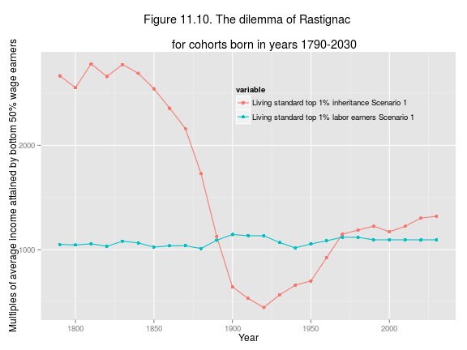 
 


qplot(year, value * 100, data=subset(ts11.melted, variable == "Cohort fraction Scenario 1"),
  geom=c("line", "point"), color=variable, xlab = "Year",
  ylab= "Fraction of each cohort") +
  xlim(1790,2030) +
  theme(legend.position=c(0.5, 0.8),
        legend.background = element_rect(fill="transparent")) +
  ggtitle("Figure 11.11. Which fraction of a cohort receives in inheritance the \n equivalent of a lifetime labor income?")


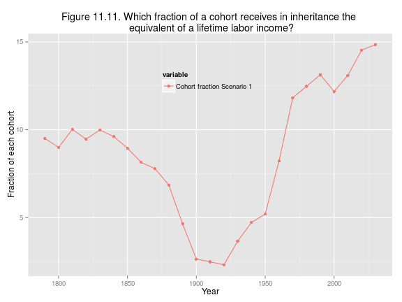 
 


ts11.3 <- read.xlsx("../_data//Chapter11TablesFigures.xlsx", sheetName="TS11.3", rowIndex=8:19, colIndex=c(1:3), header=FALSE)
names(ts11.3) <- c('year', 'UK inheritance', 'Germany Inheritance')
fig11.12 <- merge(ts11.3, ts11[c('year', "Economic flow")])
names(fig11.12)[4] <- 'France inheritance'
fig11.12.melted <- melt(fig11.12, id.var="year")
 
qplot(year, value, data=na.omit(fig11.12.melted),                                
      geom=c("line", "point"), color=variable, xlab="year",
      ylab="Annual value of inheritance and gifts (% national income)") +
  xlim(1900, 2010) +
  ggtitle("Figure 11.12. The inheritance flow in Europe 1900-2010")


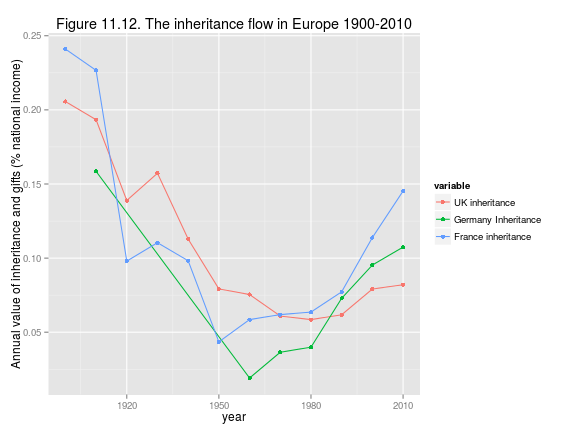 
