Capital in the 21st Century: Chapter 10
========================================================
 
### Data provenance
 
The data were downloaded as Excel files from: http://piketty.pse.ens.fr/en/capital21c2. 
 
### Loading relevant libraries and data
 
This document depends on the [xlsx](http://cran.r-project.org/web/packages/xlsx/index.html), [reshape2](http://cran.r-project.org/web/packages/reshape2/index.html), and [ggplot2](http://cran.r-project.org/web/packages/ggplot2/index.html) packages.
 
Below, we separately load the data required to make each figure.
 
 
 
 


library(ggplot2)
library(xlsx)
library(reshape2)
 
#First we'll make a quick function for melting and renaming tables
melt_name<-function(x,name,id.vars="Year",...){
  #if all measurements are missing for a given year, we will generate a versionof the figure with interpolations for that year.
  #We'll show both interpolated and non interpolated figures
  NArows<-apply(x,1,function(r) {all(is.na(r[-1]))} )
  out_interp<-melt(x[!NArows,],id.vars=id.vars,...)
  out_raw<-melt(x,id.vars=id.vars,...)
  list(out_interp,name,out_raw)
}
 
 
#####################################
 
# Spread Sheet TS10.1
 
# Concentration of wealth in Europe and USA
 
#####################################
 
#France
ts10.1a = read.xlsx("../_data/Chapter10TablesFigures.xlsx",sheetName="TS10.1",rowIndex=6:26,colIndex=1:3,header=FALSE)
names(ts10.1a) = c("Year","top 10%","top 1%")
f1data<-melt_name(ts10.1a,'Wealth Share') #data for figure 1
 
 
#France v. Paris
ts10.1b = read.xlsx("../_data/Chapter10TablesFigures.xlsx",sheetName="TS10.1",rowIndex=6:26,colIndex=c(1,3,5),header=FALSE)
names(ts10.1b) = c("Year","France","Paris")
f2data<-melt_name(ts10.1b,'Top 1% Wealth Share')
 
#For ts10.1c-ts10.1f there are several NA/missing entries
 
#United Kingdom
ts10.1c = read.xlsx("../_data/Chapter10TablesFigures.xlsx",sheetName="TS10.1",rowIndex=6:26,colIndex=c(1,6,7),header=FALSE)
names(ts10.1c) = c("Year","Top 10%","Top 1%")
f3data<-melt_name(ts10.1c,'Wealth Share')
 
#Sweden
ts10.1d = read.xlsx("../_data/Chapter10TablesFigures.xlsx",sheetName="TS10.1",rowIndex=6:26,colIndex=c(1,12:13),header=FALSE)
names(ts10.1d) = c("Year","Top 10%","Top 1%")
f4data<-melt_name(ts10.1d,'Wealth Share')
 
#United States
ts10.1e = read.xlsx("../_data/Chapter10TablesFigures.xlsx",sheetName="TS10.1",rowIndex=6:26,colIndex=c(1,9:10),header=FALSE)
names(ts10.1e) = c("Year","Top 10%","Top 1%")
f5data<-melt_name(ts10.1e,'Wealth Share')
 
#Europe & US
ts10.1f = read.xlsx("../_data/Chapter10TablesFigures.xlsx",sheetName="TS10.1",rowIndex=6:26,colIndex=c(1,9:10,15:16),header=FALSE)
names(ts10.1f) = c("Year","Top 10% (United States)","Top 1% (United States)","Top 10% (Europe)","Top 1% (Europe)")
# This table has years with partially missing data, so we have to process it differently.
NArows<-apply(ts10.1f,1,function(r) {all(is.na(r[-1]))} )#first drop years with no data.
ts10.1f_interpolated<-ts10.1f[!NArows,] #for lines
for(col in 2:ncol(ts10.1f)){
  if(any(is.na(ts10.1f_interpolated[,col]))){
    ts10.1f_interpolated[,col] <- approx(x=ts10.1f_interpolated[,1],ts10.1f_interpolated[,col],xout=ts10.1f_interpolated[,1])$y
  }
}
long_tab_points <-   melt(ts10.1f[!NArows,],id.vars='Year')
long_tab_lines  <-   melt(ts10.1f_interpolated,id.vars='Year')
long_tab_combined <- cbind(long_tab_points,interp=long_tab_lines[,'value'])
 
ts10.1f_raw_long<-melt(ts10.1f,id.vars='Year')
f6data<-list(long_tab_combined,'Wealth Share',ts10.1f_raw_long)
 
 
 
#####################################
 
# Spread Sheet TS10.2
 
# Return to capital, growth rate, capital share and savings rate in France
 
#####################################
 
ts10.2a = read.xlsx("../_data/Chapter10TablesFigures.xlsx",sheetName="TS10.2",rowIndex=10:19,colIndex=c(1,4,6),header=FALSE)
names(ts10.2a) = c("Year","Pure rate of return to capital r","Growth rate of national income g")
f7data<-melt_name(ts10.2a,'Rate')
 
 
ts10.2b = read.xlsx("../_data/Chapter10TablesFigures.xlsx",sheetName="TS10.2",rowIndex=10:19,colIndex=c(1:3),header=FALSE)
names(ts10.2b) = c("Year","Saving rate","Capital Share")
f8data<-melt_name(ts10.2b,'Percent')
 
 
#####################################
 
# Spread Sheet TS10.3
 
# Return to capital and growth rate of the world
 
#####################################
 
#r before taxes
ts10.3a = read.xlsx("../_data/Chapter10TablesFigures.xlsx",sheetName="TS10.3",rowIndex=7:15,colIndex=c(1,2,4),header=FALSE)
names(ts10.3a) = c("Year","Pure rate of return to capital r (pre-tax)","Growth rate of world output g")
f9data<-melt_name(ts10.3a,'Rate')
 
#r after taxes
ts10.3b = read.xlsx("../_data/Chapter10TablesFigures.xlsx",sheetName="TS10.3",rowIndex=7:15,colIndex=c(1,3,4),header=FALSE)
names(ts10.3b) = c("Year","Pure rate of return to capital r (after tax and capital losses)","Growth rate of world output g")
f10data<-melt_name(ts10.3b,'Rate')
 
 
ts10.3c = read.xlsx("../_data/Chapter10TablesFigures.xlsx",sheetName="TS10.3",rowIndex=7:14,colIndex=c(6,8:9),header=FALSE)
names(ts10.3c) = c("Year","Pure rate of return to capital r (after tax and capital losses)","Growth rate of world output g")
f11data<-melt_name(ts10.3c,'Rate')

 
 
## Recreate Figures
 
 
The first 6 figures follow a very similar format, so we'll create a general plotting function to shorten the code.
 


#First, a general plotting function
plot_year<-function(dat,type='raw'){
  if(type=='interp') data=dat[[1]]
  if(type=='raw') data=dat[[3]]
  ggplot(data=data)+
    geom_line(aes(x=Year,y=value,color=variable))+
    geom_point(aes(x=Year,y=value,color=variable))+
    scale_color_discrete(name=dat[[2]])
}
table1_lab<-ylab('Share of top decile or\n percentile in total wealth')
 
#Now plotting figures 1 through 3
plot_year(f1data,'interp')+table1_lab+labs(title='Figure 10.1. Wealth inequality in France')


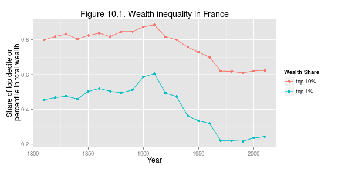 


plot_year(f2data,'interp')+ylab('Share of top percentile\n in total wealth')+labs(title='Figure 10.2. Wealth inequality : Paris vs. France')


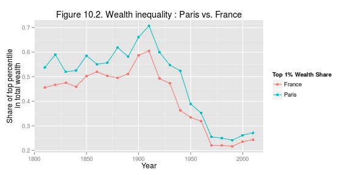 
 
In Figures 3-6, Piketty uses a linear interpolation for decades with missing data. We first recreate the figures as Piketty designed them, and then show versions of the figures without the interpolation for the missing decades.
 


plot_year(f3data,'interp')+table1_lab+labs(title='Figure 10.3. Wealth inequality in Britain')


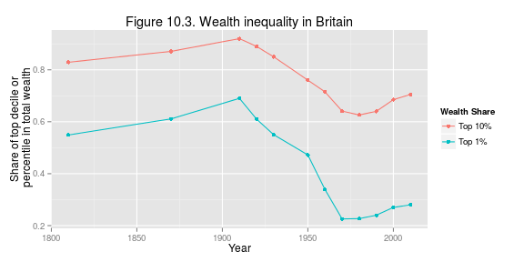 


plot_year(f4data,'interp')+table1_lab+labs(title='Figure 10.4. Wealth inequality in Sweden')


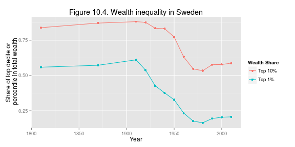 


plot_year(f5data,'interp')+table1_lab+labs(title='Figure 10.5. Wealth inequality in the U.S.')


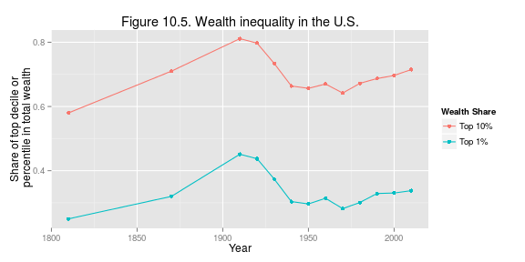 


#Figure 6 is a little more complex due how some years have partially missing data.
ggplot(data=f6data[[1]])+
  geom_line(aes(x=Year,y=interp,color=variable))+
  geom_point(aes(x=Year,y=value,color=variable))+
  scale_color_discrete(name=f6data[[2]])+
  table1_lab+
  labs(title='Figure 10.6. Wealth inequality : Europe and the U.S.')



## Warning: Removed 2 rows containing missing values (geom_point).


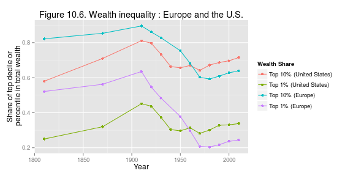 
 
If we do not interpolate the missing data, we get the following set of figures
 


plot_year(f3data,'raw')+table1_lab+labs(title='Figure 10.3. Wealth inequality in Britain (without interpolation)')



## Warning: Removed 18 rows containing missing values (geom_point).


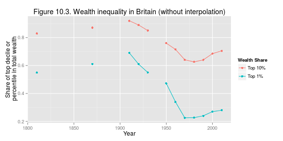 


plot_year(f4data,'raw')+table1_lab+labs(title='Figure 10.4. Wealth inequality in Sweden (without interpolation)')



## Warning: Removed 16 rows containing missing values (geom_point).


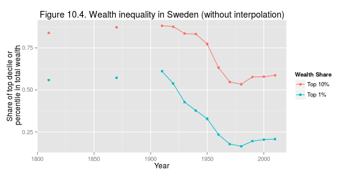 


plot_year(f5data,'raw')+table1_lab+labs(title='Figure 10.5. Wealth inequality in the U.S.  (without interpolation)')



## Warning: Removed 16 rows containing missing values (geom_point).


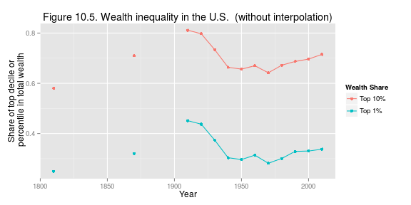 


plot_year(f6data,'raw')+table1_lab+labs(title='Figure 10.6. Wealth inequality : Europe and the U.S.\n (without interpolation)')



## Warning: Removed 34 rows containing missing values (geom_point).


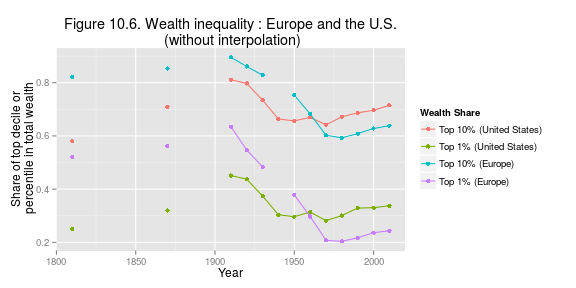 
 
 
 
Then we recreate Figures 7 and 8
 


#A general axis label
growth_lab<-ylab('Annual rate of return\n or rate of growth')
 
#Figures 7 - 8
plot_year(f7data,'raw')+growth_lab+labs(title='Figure 10.7. Return to capital and growth: France')


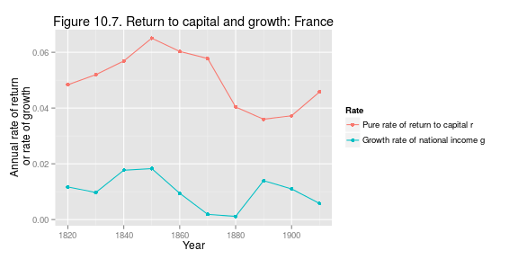 


plot_year(f8data,'raw')+ylab('Capital share or saving rate\n(% national income)')+labs(title='Figure 10.8. Capital share and saving rate: France')+theme(legend.title=element_blank())


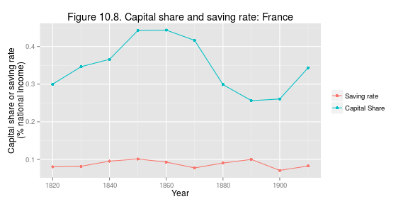 
 
If each of figures 9-11, we use a different axis spacing than that of Piketty. Piketty plots data for time periods of different lengths (e.g., Antiquity-1000, and years 1950-2012). These time periods are non-overlapping, and collectively contain either all years from Antiquity to 2100 (Figures 9 and 10) or all years from Antiquity to 2200 (Figure 11). In the plots below, the position along the x-axis also corresponds to a time period. However, marks are spaced and labeled according to the final year of each time period, with the first mark corresponding to the period from Antiquity to the year 1000. For example, x-axis position at 1700 represent rates from the years 1500-1700. We space tick marks on the x-axis proportionally, based final year of each period, where as Piketty uses equal spacing between each time period regardless of the lengths of the time periods.
 


#Function to convert year span to final year
getFinal<-function(x){
   out<-as.numeric(substr(x,6,9))
  for(i in 1:length(x)){ #adjust for 0-1000
    if(x[i]=='0-1000') out[i]<- 1000
    }
  out
}
plot_range<-function(dat,title){
   ggplot(data=dat[[1]],sub='bel')+
    geom_line(aes(x=getFinal(Year),y=value,color=variable))+
    geom_point(aes(x=getFinal(Year),y=value,color=variable))+
    xlab('Year range end point')+
    scale_color_discrete(name=dat[[2]])+
    growth_lab+
    theme(legend.position='bottom',axis.text.x=element_text(angle=45,hjust=1))+
    labs(title=title)+
    scale_x_continuous(breaks=getFinal(dat[[1]]$Year))
  }
 
plot_range(f9data,title='Figure 10.9. Rate of return vs. growth rate at world level,\n from Antiquity until 2100')



## Error in eval(expr, envir, enclos): could not find function "getFinal"



plot_range(f10data,title='Figure 10.10. After tax rate of return vs. growth at the world level,\n from Antiquity until 2100')



## Error in eval(expr, envir, enclos): could not find function "getFinal"



plot_range(f11data,title='Figure 10.11. After tax rate of return vs. growth at the world level,\n from Antiquity until 2200')



## Error in eval(expr, envir, enclos): could not find function "getFinal"

 
 
 
In the excel file from which we draw data from here, the table for Figure 11 is constructed based on the table for Figure 10, combining information from different time periods. Otherwise, the labels for these figures and tables are the same.
 
 
 
