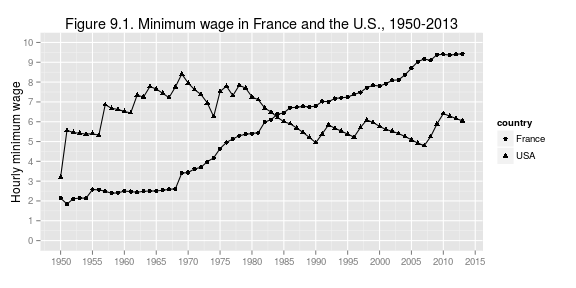
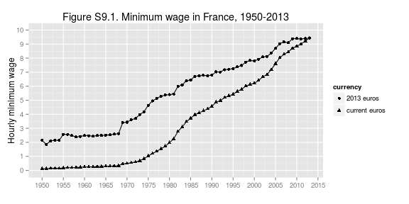
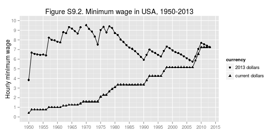
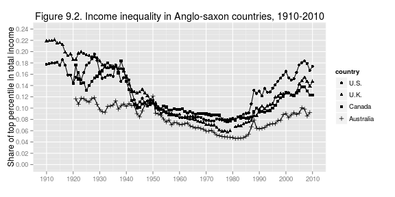
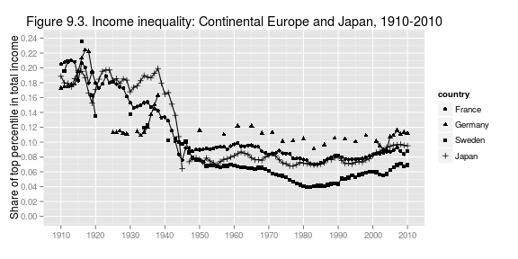
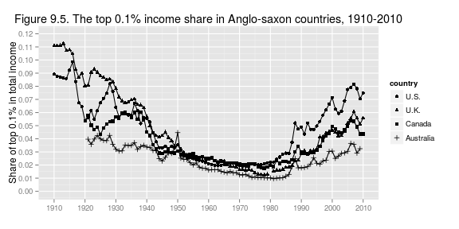
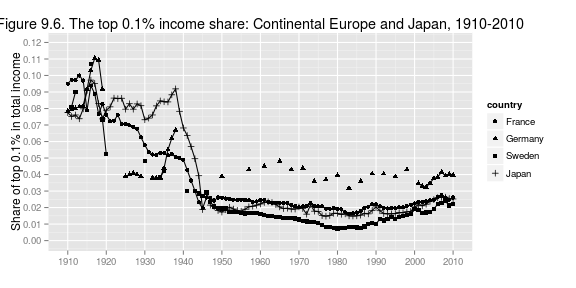

Capital in the 21st Century: Chapter 9
========================================================
 
### Data provenance
 
The data were downloaded as Excel files from: http://piketty.pse.ens.fr/en/capital21c2. 
 
### Loading relevant libraries and data
 
This document depends on the [xlsx](http://cran.r-project.org/web/packages/xlsx/index.html), [reshape2](http://cran.r-project.org/web/packages/reshape2/index.html), and [ggplot2](http://cran.r-project.org/web/packages/ggplot2/index.html) packages.
 
 


library(ggplot2)
library(xlsx)
library(reshape2)

 
## Figures 9.1 and Supplementary Figures
 
These figures are based on Table TS9.1. Here we read
data from the excel file and name the data series
 


## Table TS9.1
ts91 = read.xlsx("../_data/Chapter9TablesFigures.xlsx",sheetName="TS9.1",rowIndex=7:70,colIndex=1:8,header=FALSE)
names(ts91) = c("year","france_francs_cur","france_euros_cur", "france_euros_2013", "france_cpi", "us_dollars_cur", "us_dollars_2013", "us_cpi")

 
The caption of the table lists the sources for this table
as 
 
> Sources. France: file "IPP-prelevements-sociaux-avril2012.xls" 
> available on www.ipp.eu (we selected the values corresponding to January the 1st of each year; the
> complete revaluation series are given in the IPP table)
> USA: official series of Bureau of Labor Statistics (we 
> selected the values corresponding to January the 1st of 
> each year; the complete revaluation series are given in 
> the BLS file)
> (consumer price index for France et US from Piketty-Zucman 2013, 
> files France.xls et USA.xls; links frozen on 2-20-13)
 
Now we make Figure F9.1
 


f91dat <- ts91[,c("year","france_euros_2013", "us_dollars_2013")]
names(f91dat) <- c("year","France","USA")
 
# ggplot2 doesn't support plots with 2 y axes 
# so it only shows wages in Euros
 
# scale to trick the two axes plot
f91dat$USA <- f91dat$USA / 1.2
f91dat <- melt(f91dat, id.var="year")
names(f91dat) <- c("year","country","wage")
 
plt <- ggplot(data=f91dat,aes(x=year, y=wage,group=country)) 
plt <- plt + geom_line() + geom_point(aes(shape=country))
plt <- plt + scale_y_continuous(breaks=seq(0,10), limits=c(0,10), name="Hourly minimum wage") 
plt <- plt + scale_x_continuous(breaks=seq(1950,2015,by=5), name="")
plt <- plt + ggtitle("Figure 9.1. Minimum wage in France and the U.S., 1950-2013")
plt


 
 
And Figures S9.1 and S9.2
 


fs91dat <- ts91[,c("year","france_euros_2013", "france_euros_cur")]
names(fs91dat) <- c("year", "2013 euros", "current euros")
fs91dat <- melt(fs91dat, id.var="year")
names(fs91dat) <- c("year", "currency", "wage")
 
plt <- ggplot(data=fs91dat, aes(x=year,y=wage,group=currency))
plt <- plt + geom_line() + geom_point(aes(shape=currency))
plt <- plt + scale_y_continuous(name="Hourly minimum wage", limits=c(0,10), breaks=seq(0,10,by=1))
plt <- plt + scale_x_continuous(name="", limits=c(1950,2013), breaks=seq(1950,2015,by=5))
plt <- plt + ggtitle("Figure S9.1. Minimum wage in France, 1950-2013")
 
plt


 
 


fs92dat <- ts91[,c("year","us_dollars_2013", "us_dollars_cur")]
names(fs92dat) <- c("year", "2013 dollars", "current dollars")
fs92dat <- melt(fs92dat, id.var="year")
names(fs92dat) <- c("year", "currency", "wage")
 
plt <- ggplot(data=fs92dat, aes(x=year,y=wage,group=currency))
plt <- plt + geom_line() + geom_point(aes(shape=currency))
plt <- plt + scale_y_continuous(name="Hourly minimum wage", limits=c(0,10), breaks=seq(0,10,by=1))
plt <- plt + scale_x_continuous(name="", limits=c(1950,2013), breaks=seq(1950,2015,by=5))
plt <- plt + ggtitle("Figure S9.2. Minimum wage in USA, 1950-2013")
 
plt



## Warning: Removed 1 rows containing missing values (geom_point).


 
 
## Table S8.1 (copied)
 


ts81 <- read.xlsx("../_data//Chapter9TablesFigures.xlsx", sheetName="CopyTS8.1", colIndex=1:6, rowIndex=6:116, header=FALSE)
names(ts81) <- c("year", "fr_10.0", "fr_1.0", "fr_0.1",
                 "fr_wage_10.0", "fr_wage_1.0")

 
Caption:
 
> Top income shares series based upon WTID series; 
> missing values interpolated using moving averages and 
> top 5% and top 1% series (see formulas and "Details" 
> sheet)
>
> Top wage series: Piketty 2001 (figure 3.2) (missing 
> values for 1910-1918, 1939-1946, and 1999-2010 
> interpolated using income series and composition 
> series, and series from Landais 2007 and Godechot 2012
> )
> 
> copied from TS8.1 (links frozen on 2-25-2013)
 
## Table S8.2 (copied)


ts82 <- read.xlsx("../_data/Chapter9TablesFigures.xlsx", sheetName="CopyTS8.2", colIndex=1:11, rowIndex=6:116, header=FALSE)
names(ts82) <- c("year", "us_10.0", "us_10.0-5.0","us_5.0",
                 "us_1.0", "us_0.1", "us_10.0_noCapGains", "us_1.0_noCapGains", "us_0.1_noCapGains", "us_wageShare_10.0", "us_wageShare_1.0")

 
The caption of the table lists the sources for this table as 
 
> Top income shares series based upon WTID series; 
> missing values interpolated using moving averages and 
> top 5% and top 1% series (see formulas and "Details" 
> sheet)
>
> Top wage series: Piketty-Saez 2003 (Table B2, updated 
> 2012) (missing values for 1913-1926 interpolated using 
> income series and composition series (see also series 
> on officers compensation 1917-1926 referred to by 
> Piketty-Saez 2003 pp.29-30
>
> copied from TS8.2 (links frozen on 2-25-2013)
 
## Table S9.2
 


ts92 <- read.xlsx("../_data/Chapter9TablesFigures.xlsx",sheetName="TS9.2",rowIndex=6:116,colIndex=1:12,header=FALSE)
names(ts92) = c("year","royaume_10.0","royaume_1.0", "royaume_0.1", "germany_10.0", "germany_1.0", "germany_0.1", "sweden_10.0", "sweden_1.0", "sweden_0.1", "japan_1.0", "japan_0.1")

 
The caption of the table lists the sources for this table as 
 
> Top income shares series based upon WTID series; 
> missing values interpolated using moving averages and 
> top 5% and top 1% series (see formulas and "Details" 
> sheet)
> copied from DetailsTS9.2 (links frozen on 2-25-2013)
 
The `DetailsTS9.2` table is in [Chapter 8](../chapter8/chapter8.html).
 
## Table S9.3
 


ts93 <- read.xlsx("../_data//Chapter9TablesFigures.xlsx", sheetName="TS9.3", rowIndex=6:116,
                  colIndex=1:15,header=FALSE)
names(ts93) <- c("year", "canada_1.0", "canada_0.1",
                 "aus_1.0","aus_0.1", "nzl_1.0", "nzl_0.1",
                 "den_1.0","den_0.1","ita_1.0","ita_0.1",
                 "hol_1.0","hol_0.1","spa_1.0","spa_0.1")

 
Caption from spreadsheet: 
 
> Top income shares series based upon WTID series; 
> missing values interpolated using moving averages (see 
> formulas and "Details" sheet)
>
> copied from DetailsTS9.3 (links frozen on 2-25-2013)
 
## Figure 9.2
 


f92dat <- data.frame(year=ts92$year,
  `U.S.`=ts82$`us_1.0_noCapGains`,
  `U.K.`=ts92$`royaume_1.0`,
  `Canada`=ts93$`canada_1.0`,
  `Australia`=ts93$`aus_1.0`
  )
f92dat <- melt(f92dat, id.var="year")
names(f92dat) <- c("year", "country", "share")
 
plt <- ggplot(data=f92dat, aes(x=year,y=share,group=country))
plt <- plt + geom_line() + geom_point(aes(shape=country))
plt <- plt + scale_y_continuous(name="Share of top percentile in total income", breaks=seq(0,24,by=2)/100,limits=c(0,24)/100)
plt <- plt + scale_x_continuous(name="", breaks=seq(1910,2010,by=10),limits=c(1910,2010))
plt <- plt + ggtitle("Figure 9.2. Income inequality in Anglo-saxon countries, 1910-2010")
plt



## Warning: Removed 62 rows containing missing values (geom_path).



## Warning: Removed 65 rows containing missing values (geom_point).


 
 
## Figure 9.3


f93dat <- data.frame(year=ts92$year,
                     `France`=ts81$`fr_1.0`,
                     `Germany`=ts92$`germany_1.0`,
                     `Sweden`=ts92$`sweden_1.0`,
                     `Japan`=ts92$`japan_1.0`)
f93dat <- melt(f93dat, id.var="year")
names(f93dat) <- c("year","country","share")
 
plt <- ggplot(data=f93dat, aes(x=year, y=share, group=country))
plt <- plt + geom_line() + geom_point(aes(shape=country))
plt <- plt + scale_y_continuous(name="Share of top percentile in total income", breaks=seq(0,24,by=2)/100,
                                limits=c(0,.24))
plt <- plt + scale_x_continuous(name="", breaks=seq(1910,2010,by=10), limits=c(1910,2010))
plt <- plt + ggtitle("Figure 9.3. Income inequality: Continental Europe and Japan, 1910-2010")
plt



## Warning: Removed 41 rows containing missing values (geom_path).



## Warning: Removed 119 rows containing missing values (geom_point).


 
 
## Figure 9.4


f94dat <- data.frame(year=ts92$year,
                     `France`=ts81$`fr_1.0`,
                     `Denmark`=ts93$`den_1.0`,
                     `Italy`=ts93$`ita_1.0`,
                     `Spain`=ts93$`spa_1.0`)
f94dat <- melt(f94dat, id.var="year")
names(f94dat) <- c("year", "country", "share")
 
plt <- ggplot(data=f94dat, aes(x=year, y=share, group=country))
plt <- plt + geom_line() + geom_point(aes(shape=country))
plt <- plt + scale_y_continuous(name="Share of top percentile in total income", breaks=seq(0,24,by=2)/100, limits=c(0,.24))
plt <- plt + scale_x_continuous(name="", breaks=seq(1900,2010,by=10), limits=c(1910,2010))
plt <- plt + ggtitle("Figure 9.4. Income inequality: Northern and Southern Europe, 1910-2010")
plt



## Warning: Removed 129 rows containing missing values (geom_path).



## Warning: Removed 162 rows containing missing values (geom_point).


 
## Figure 9.5


f92dat <- data.frame(year=ts92$year,
  `U.S.`=ts82$`us_0.1_noCapGains`,
  `U.K.`=ts92$`royaume_0.1`,
  `Canada`=ts93$`canada_0.1`,
  `Australia`=ts93$`aus_0.1`
  )
f92dat <- melt(f92dat, id.var="year")
names(f92dat) <- c("year", "country", "share")
 
plt <- ggplot(data=f92dat, aes(x=year,y=share,group=country))
plt <- plt + geom_line() + geom_point(aes(shape=country))
plt <- plt + scale_y_continuous(name="Share of top 0.1% in total income", breaks=seq(0,12,by=1)/100,limits=c(0,12)/100)
plt <- plt + scale_x_continuous(name="", breaks=seq(1910,2010,by=10),limits=c(1910,2010))
plt <- plt + ggtitle("Figure 9.5. The top 0.1% income share in Anglo-saxon countries, 1910-2010")
plt



## Warning: Removed 62 rows containing missing values (geom_path).



## Warning: Removed 65 rows containing missing values (geom_point).


 
 
## Figure 9.6


f93dat <- data.frame(year=ts92$year,
                     `France`=ts81$`fr_0.1`,
                     `Germany`=ts92$`germany_0.1`,
                     `Sweden`=ts92$`sweden_0.1`,
                     `Japan`=ts92$`japan_0.1`)
f93dat <- melt(f93dat, id.var="year")
names(f93dat) <- c("year","country","share")
 
plt <- ggplot(data=f93dat, aes(x=year, y=share, group=country))
plt <- plt + geom_line() + geom_point(aes(shape=country))
plt <- plt + scale_y_continuous(name="Share of top 0.1% in total income", breaks=seq(0,12,by=1)/100,
                                limits=c(0,.12))
plt <- plt + scale_x_continuous(name="", breaks=seq(1910,2010,by=10), limits=c(1910,2010))
plt <- plt + ggtitle("Figure 9.6. The top 0.1% income share: Continental Europe and Japan, 1910-2010")
plt



## Warning: Removed 41 rows containing missing values (geom_path).



## Warning: Removed 119 rows containing missing values (geom_point).


 
