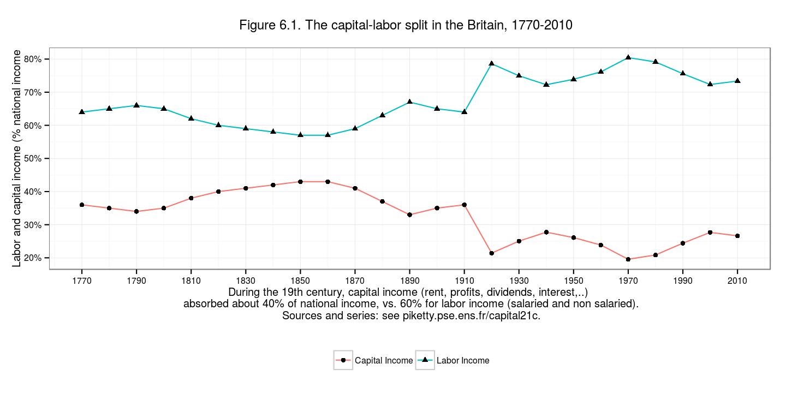
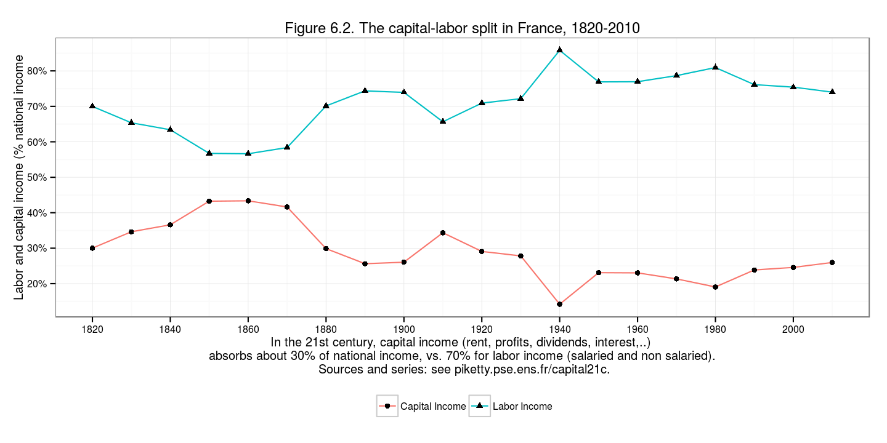
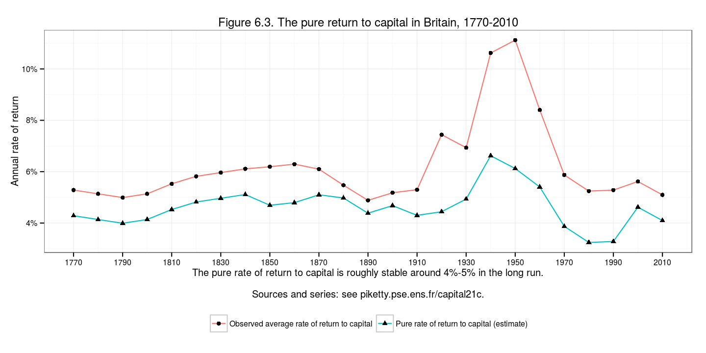
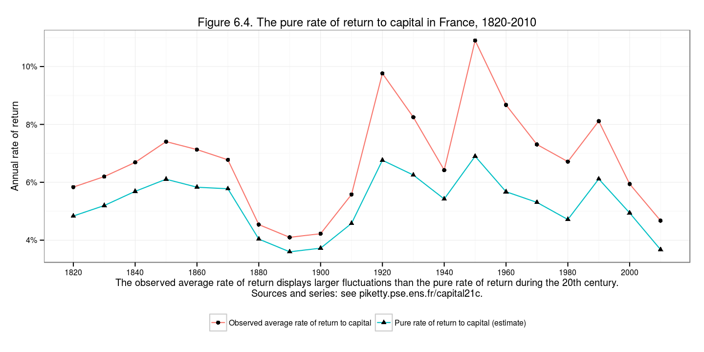
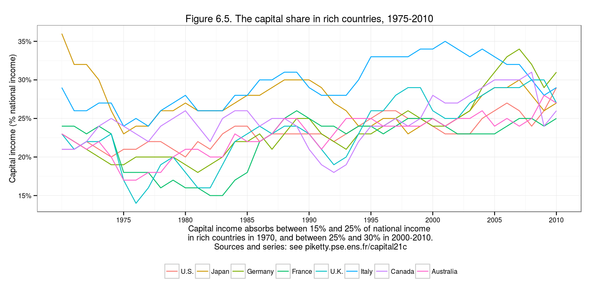
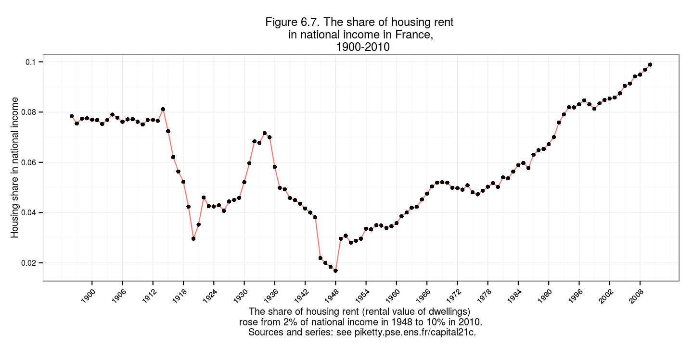
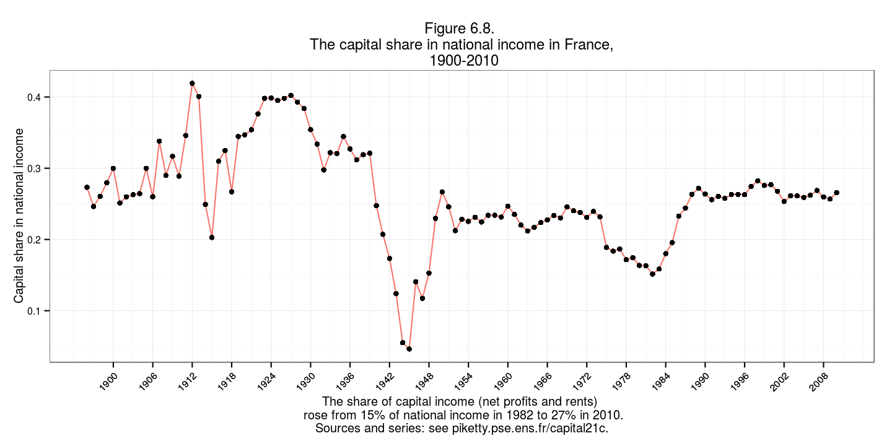

Capital in the 21st Century: Chapter 6
========================================================
 
### Data provenance
 
The data were downloaded as Excel files from: http://piketty.pse.ens.fr/en/capital21c2. 
 
### Loading relevant libraries and data
 
This document depends on the [xlsx](http://cran.r-project.org/web/packages/xlsx/index.html), [reshape2](http://cran.r-project.org/web/packages/reshape2/index.html), [scales](http://cran.r-project.org/web/packages/scales/index.html), [plyr](http://cran.r-project.org/web/packages/plyr/index.html), and [ggplot2](http://cran.r-project.org/web/packages/ggplot2/index.html) packages.
 
 


library(ggplot2)
library(xlsx)
library(reshape2)
library(scales)

 
### Fig 6.1


# series used for figures 6.1, 6.3 et S6.1
s1 = read.xlsx("../_data/Chapter6TablesFigures.xlsx", sheetName="TS6.1", rowIndex=8:33,colIndex=1:3,header=TRUE)
 
names(s1) =  c('Year','Capital Income', 'Labor Income')

 


s1 <- melt(s1, id.vars = 'Year')

 


ggplot(data = s1, aes(x=Year, y=value))+
  geom_line(aes(color=variable))+
  geom_point(aes(shape=variable))+
  scale_y_continuous(breaks=seq(0, 1, 0.1), labels=c('0%', '10%','20%', '30%','40%', '50%','60%', '70%','80%', '90%','100%'))+
  scale_x_continuous(breaks=seq(1770, 2010, 20), labels=seq(1770, 2010, 20))+
  ylab('Labor and capital income (% national income')+
  xlab('During the 19th century, capital income (rent, profits, dividends, interest,..) \n absorbed about 40% of national income, vs. 60% for labor income (salaried and non salaried).\n Sources and series: see piketty.pse.ens.fr/capital21c.
')+
  ggtitle('Figure 6.1. The capital-labor split in the Britain, 1770-2010  
')+
  theme_bw(10)+ # Make b/w theme
  theme(legend.title=element_blank())+ # remove legend title
  theme(legend.position="bottom") # remove legend title


 
### Fig 6.2
 


# series used for figures 6.2, 6.4 et S6.2
s2 = read.xlsx("../_data/Chapter6TablesFigures.xlsx",
               sheetName="TS6.2", rowIndex=6:26,colIndex=1:3,header=TRUE)
 
names(s2) =  c('Year','Capital Income', 'Labor Income')

 


s2 <- melt(s2, id.vars = 'Year')

 


ggplot(data = s2, aes(x=Year, y=value))+
  geom_line(aes(color=variable))+
  geom_point(aes(shape=variable))+
  scale_y_continuous(breaks=seq(0, 1, 0.1), labels=c('0%', '10%','20%', '30%','40%', '50%','60%', '70%','80%', '90%','100%'))+
  scale_x_continuous(breaks=seq(1820, 2010, 20), labels=seq(1820, 2010, 20))+
  ylab('Labor and capital income (% national income')+
  xlab('In the 21st century, capital income (rent, profits, dividends, interest,..) \nabsorbs about 30% of national income, vs. 70% for labor income (salaried and non salaried).\n Sources and series: see piketty.pse.ens.fr/capital21c.')+
  ggtitle('Figure 6.2. The capital-labor split in France, 1820-2010')+
  theme_bw(10)+ # Make b/w theme
  theme(legend.title=element_blank())+ # remove legend title
  theme(legend.position="bottom") # remove legend title


 
### Fig 6.3


# series used for figures 6.1, 6.3 et S6.1
s3 = read.xlsx("../_data/Chapter6TablesFigures.xlsx",
               sheetName="TS6.1", rowIndex=8:33,colIndex=c(1,4:5),header=TRUE)
 
names(s3) =  c('Year','Observed', 'Pure')

 


s3 <- melt(s3, id.vars = 'Year')

 


ggplot(data = s3, aes(x=Year, y=value))+
  geom_line(aes(color=variable))+
  geom_point(aes(shape=variable))+
  scale_y_continuous(breaks=seq(0, 0.16, 0.02), labels=c('0%', '2%','4%', '6%','8%', '10%','12%', '14%','16%'))+
  scale_x_continuous(breaks=seq(1770, 2010, 20), labels=seq(1770, 2010, 20))+
  ylab('Annual rate of return')+
  xlab('The pure rate of return to capital is roughly stable around 4%-5% in the long run.\n 
Sources and series: see piketty.pse.ens.fr/capital21c.')+
  ggtitle('Figure 6.3. The pure return to capital in Britain, 1770-2010')+
  scale_shape_discrete(name='', 
                       breaks=c('Observed', 'Pure'),
                       labels=c('Observed average rate of return to capital', 
                                'Pure rate of return to capital (estimate)'))+
  scale_color_discrete(name='', 
                       breaks=c('Observed', 'Pure'),
                       labels=c('Observed average rate of return to capital', 
                                'Pure rate of return to capital (estimate)'))+
  theme_bw(10)+ # Make b/w theme
  theme(legend.title=element_blank())+ # remove legend title
  theme(legend.position="bottom") # remove legend title


 
### Fig 6.4


# series used for figures 6.1, 6.3 et S6.1
s4 = read.xlsx("../_data/Chapter6TablesFigures.xlsx",
               sheetName="TS6.2", rowIndex=6:26,colIndex=c(1,4:5),header=TRUE)
 
names(s4) =  c('Year','Observed', 'Pure')

 


s4 <- melt(s4, id.vars = 'Year')

 


ggplot(data = s4, aes(x=Year, y=value))+
  geom_line(aes(color=variable))+
  geom_point(aes(shape=variable))+
  scale_y_continuous(breaks=seq(0, 0.16, 0.02), labels=c('0%', '2%','4%', '6%','8%', '10%','12%', '14%','16%'))+
  scale_x_continuous(breaks=seq(1820, 2010, 20), labels=seq(1820, 2010, 20))+
  ylab('Annual rate of return')+
  xlab('The observed average rate of return displays larger fluctuations than the pure rate of return during the 20th century.\nSources and series: see piketty.pse.ens.fr/capital21c.')+
  ggtitle('Figure 6.4. The pure rate of return to capital in France, 1820-2010')+
  scale_shape_discrete(name='', 
                       breaks=c('Observed', 'Pure'),
                       labels=c('Observed average rate of return to capital', 
                                'Pure rate of return to capital (estimate)'))+
  scale_color_discrete(name='', 
                       breaks=c('Observed', 'Pure'),
                       labels=c('Observed average rate of return to capital', 
                                'Pure rate of return to capital (estimate)'))+
  theme_bw(10)+ # Make b/w theme
  theme(legend.title=element_blank())+ # remove legend title
  theme(legend.position="bottom")


 
### Fig 6.5


# series used for figures 6.1, 6.3 et S6.1
s5 = read.xlsx("../_data/Chapter6TablesFigures.xlsx",
               sheetName="TS6.3", rowIndex=4:45,colIndex=1:9,header=TRUE)
 
names(s5) =  c('Year','U.S.', 'Japan', 'Germany', 
               'France',	'U.K.',	'Italy',	'Canada',	'Australia')

 


s5 <- melt(s5, id.vars = 'Year')
# round data for rChart tooltip display
s5$value <- round(s5$value, 2)

 
 


ggplot(data = s5, aes(x=Year, y=value))+
  geom_line(aes(color=variable))+
#   geom_point(aes(shape=variable))+
  scale_y_continuous(labels = percent)+
  scale_x_continuous(breaks=seq(1975, 2010, 5), labels=seq(1975, 2010, 5))+
  ylab('Capital income (% national income)')+
  xlab('Capital income absorbs between 15% and 25% of national income\n in rich countries in 1970, and between 25% and 30% in 2000-2010.\n Sources and series: see piketty.pse.ens.fr/capital21c')+
  ggtitle('Figure 6.5. The capital share in rich countries, 1975-2010')+
  theme_bw(10)+ # Make b/w theme
  theme(legend.title=element_blank())+ # remove legend title
  theme(legend.position="bottom")


 
###Fig 6.5 with rCharts
 
The plot above is rather difficult to read with so many series. Recommend taking advantage of an interactive [rChart](http://ramnathv.github.io/rCharts/). Now we can toggle the countries `on and off` by clicking the legend labels.
 


require(devtools)
install_github('rCharts', 'ramnathv')

 


library(rCharts)



Error in library(rCharts): there is no package called 'rCharts'



fig6.5 <- nPlot(value ~ Year, group = 'variable', data = s5, type = 'lineChart') 



Error in eval(expr, envir, enclos): could not find function "nPlot"



fig6.5$yAxis(axisLabel = 'Capital income (% national income)')



Error in eval(expr, envir, enclos): object 'fig6.5' not found



fig6.5$chart(margin = list(left = 100)) # margin makes room for label



Error in eval(expr, envir, enclos): object 'fig6.5' not found



fig6.5$yAxis(tickFormat = "#! function(d) {return Math.round(d*100*100)/100 + '%'} !#")



Error in eval(expr, envir, enclos): object 'fig6.5' not found



fig6.5$xAxis(axisLabel = 'Year')



Error in eval(expr, envir, enclos): object 'fig6.5' not found



fig6.5$chart(useInteractiveGuideline=TRUE)



Error in eval(expr, envir, enclos): object 'fig6.5' not found



fig6.5$show('inline', include_assets = TRUE, cdn = TRUE)



Error in eval(expr, envir, enclos): object 'fig6.5' not found

 
### Fig 6.7


# series used for figures 6.6-6.8 and S6.3
s7 = read.xlsx("../_data/Chapter6TablesFigures.xlsx", sheetName="TS6.4", rowIndex=5:120,colIndex=1:6,header=TRUE)
 
names(s7) =  c('Year','Housing share in national income',
               'Gross profit share in gross value added',
               'Net profits share in net value added',
               'Capital share in national income',
               'After-tax capital income excl. retained earnings'
               )

 


s7 <- melt(s7, id.vars = 'Year')
s7 =s7[s7$variable == 'Housing share in national income', ]

 


ggplot(data = s7, aes(x=Year, y=value))+
  geom_line(aes(color=variable))+
  geom_point(aes(shape=variable))+
  scale_y_continuous(breaks=seq(0, .12, .02)
                     , labels=seq(0, .12, .02))+
  scale_x_continuous(breaks=seq(1900, 2008, 6)
                    , labels=seq(1900, 2008, 6))+
  ylab(unique(s7$variable))+
  xlab('The share of housing rent (rental value of dwellings) \n rose from 2% of national income in 1948 to 10% in 2010. \n Sources and series: see piketty.pse.ens.fr/capital21c.')+
  ggtitle('Figure 6.7. The share of housing rent \n in national income in France, \n 1900-2010')+
  theme_bw(10)+ # Make b/w theme
  theme(legend.title=element_blank() )+ # remove legend title
  theme(axis.text.x = element_text(angle = 45, hjust = 1)) +      theme(legend.position = "none")


 
### Fig 6.8


# series used for figures 6.6-6.8 and S6.3
s8 = read.xlsx("../_data/Chapter6TablesFigures.xlsx", sheetName="TS6.4", rowIndex=5:120,colIndex=1:6,header=TRUE)
 
names(s8) =  c('Year','Housing share in national income',
               'Gross profit share in gross value added',
               'Net profits share in net value added',
               'Capital share in national income',
               'After-tax capital income excl. retained earnings'
               )

 


s8 <- melt(s8, id.vars = 'Year')
s8 <- s8[s8$variable == 'Capital share in national income',]

 


ggplot(data = s8, aes(x=Year, y=value))+
  geom_line(aes(color=variable))+
  geom_point(aes(shape=variable))+
  scale_y_continuous(breaks=seq(0, .5, .1 )
                     , labels=seq(0, .5, .1 ))+
  scale_x_continuous(breaks=seq(1900, 2008, 6)
                    , labels=seq(1900, 2008, 6))+
  ylab(unique(s8$variable))+
  xlab('The share of capital income (net profits and rents) \n  rose from 15% of national income in 1982 to 27% in 2010. \n Sources and series: see piketty.pse.ens.fr/capital21c. ')+
  ggtitle('Figure 6.8. \n The capital share in national income in France, \n 1900-2010')+
  theme_bw(10)+ # Make b/w theme
  theme(legend.title=element_blank() )+ # remove legend title
  theme(axis.text.x = element_text(angle = 45, hjust = 1)) +      theme(legend.position = "none")


