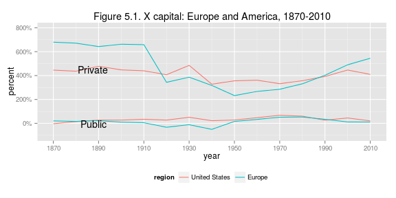
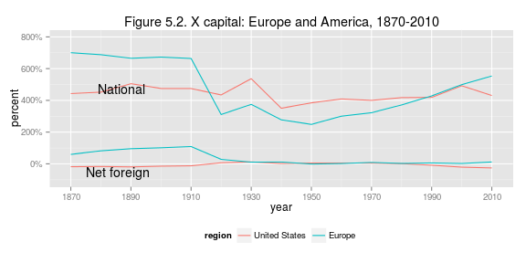
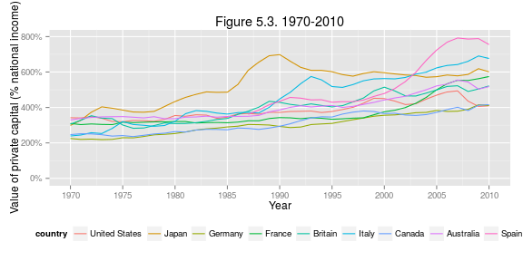
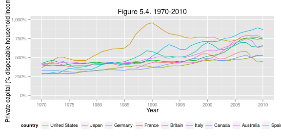
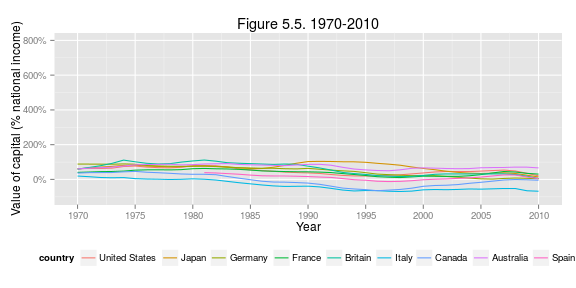
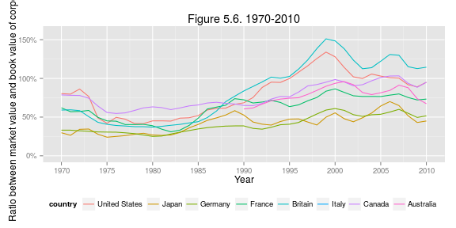
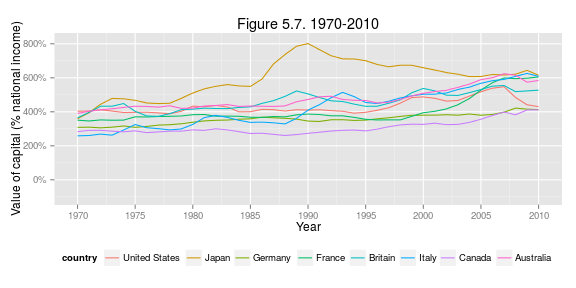
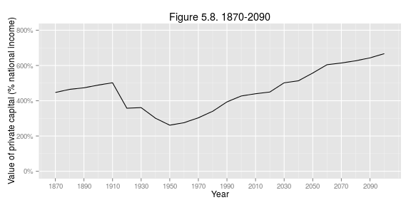

Capital in the 21st Century: Chapter 5
========================================================
 
### Data provenance
 
The data were downloaded as Excel files from: http://piketty.pse.ens.fr/en/capital21c2. 
 
### Loading relevant libraries and data
 
This document depends on the [xlsx](http://cran.r-project.org/web/packages/xlsx/index.html), [reshape2](http://cran.r-project.org/web/packages/reshape2/index.html), [scales](http://cran.r-project.org/web/packages/scales/index.html), [plyr](http://cran.r-project.org/web/packages/plyr/index.html), and [ggplot2](http://cran.r-project.org/web/packages/ggplot2/index.html) packages.
 


library(ggplot2)
library(xlsx)
library(reshape2)
### scales for percent of the axes
library(scales)

 
These figures are based on Table CTS4.5. Here we read data from the excel file and name the data series.
 


## Table CTS4.5
tab_private = read.xlsx("../_data/Chapter5TablesFigures.xlsx",sheetName="CTS4.5", rowIndex=6:20, colIndex=1:6, header=FALSE)
names(tab_private) =  c("year","usa", "germany", "france", "uk", "europe")
tab_private$capital_type <- as.factor("Private")
 
tab_national = read.xlsx("../_data/Chapter5TablesFigures.xlsx",sheetName="CTS4.5",rowIndex=6:20, colIndex=c(1, 7:11), header=FALSE)
names(tab_national) =  c("year","usa", "germany", "france", "uk", "europe")
tab_national$capital_type <- as.factor("National")
 
tab_public = read.xlsx("../_data/Chapter5TablesFigures.xlsx",sheetName="CTS4.5", rowIndex=6:20, colIndex=c(1, 12:16), header=FALSE)
names(tab_public) =  c("year","usa", "germany", "france", "uk", "europe")
tab_public$capital_type <- as.factor("Public")
 
tab_foreign = read.xlsx("../_data/Chapter5TablesFigures.xlsx",sheetName="CTS4.5", rowIndex=6:20, colIndex=c(1, 21:25), header=FALSE)
names(tab_foreign) =  c("year","usa", "germany", "france", "uk", "europe")
tab_foreign$capital_type <- as.factor("Net foreign")
 
tab <- Reduce(function(x, y) merge(x, y, all=TRUE), list(tab_private, tab_national, tab_public, tab_foreign))

 
The caption of the table lists the sources for this table as: 
 
> Links to PZ 2013 frozen on 8-2-2013
 
## Figures 5.1, and 5.2
 


run51 = function(tab, num, capital_types){
  fdat <- tab[,c("year","capital_type","usa","europe")]
  names(fdat) <- c("year","capital_type", "United States","Europe")
  
  # Make the data long for stacking
  fdat <- melt(fdat, id.vars=c("year", "capital_type"))
  names(fdat) <- c("year", "capital_type", "region", "percent")
  fdat <- subset(fdat, capital_type %in% capital_types)
  
#  qplot(year, percent, data=fdat, geom="path", colour=region, xlab="Year", ylab="Value of private and public capital (% national income)") + 
#    scale_y_continuous(labels = percent, limits = c(0, 8)) +
#    ggtitle(paste0("Figure ", num, ". Private and public capital: Europe and America, 1870-2010")) +
#    theme(legend.position="bottom", legend.background = element_rect(fill="transparent")) +
#    scale_x_continuous(breaks = seq(1870, 2010, by=20))
  
  ggplot() +
    geom_line(data=fdat, aes(x=year, y=percent, colour=region, group=interaction(region, capital_type))) +
    scale_y_continuous(labels = percent, limits = c(-1, 8)) +
    ggtitle(paste0("Figure ", num, ". X capital: Europe and America, 1870-2010")) +
    theme(legend.position="bottom", legend.background = element_rect(fill="transparent")) +
    scale_x_continuous(breaks = seq(1870, 2010, by=20)) +
    geom_text(data = subset(fdat, region == "United States")[fdat$year == 1890,], aes(x=year, y=percent, label = capital_type), hjust = 0.7, vjust = 1)
}

 


run51(tab, num = "5.1", c("Private", "Public"))



## Warning: Removed 2 rows containing missing values (geom_text).


 
 


run51(tab, num = "5.2", c("National", "Net foreign"))



## Warning: Removed 2 rows containing missing values (geom_text).


 
 
## Figure 5.3
 


## Table TS5.1
tab = read.xlsx("../_data/Chapter5TablesFigures.xlsx",sheetName="TS5.1",rowIndex=5:45,colIndex=1:10,header=FALSE)
names(tab) =  c("year","us","japan", "germany", "france", "uk", "italy", "canada", "australia", "spain")

 
Let's make a function that will plot our data
 


run53 = function(tab, num, y_min, y_max, y_label){
  fdat <- tab[,c("year","us","japan", "germany", "france", "uk", "italy", "canada", "australia", "spain")]
  names(fdat) <- c("year","United States","Japan", "Germany", "France", "Britain", "Italy", "Canada", "Australia", "Spain")
  
  # Make the data long for stacking
  fdat <- melt(fdat, id.var="year")
  names(fdat) <- c("year","country","percent")
  
  qplot(year, percent, data=fdat, geom="path", colour=country, xlab="Year", ylab=y_label) + 
    scale_y_continuous(labels = percent, limits = c(y_min, y_max)) +
    ggtitle(paste0("Figure ", num, ". 1970-2010")) +
    theme(legend.position="bottom", legend.background = element_rect(fill="transparent")) +
    scale_x_continuous(breaks = seq(1970, 2010, by=5))
}

 
Now we make Figure F5.3:
 


run53(tab, num = "5.3", y_min = 0, y_max = 8, y_label = "Value of private capital (% national income)")



## Warning: Removed 17 rows containing missing values (geom_path).


 
 


## Table TS5.12
tab = read.xlsx("../_data/Chapter5TablesFigures.xlsx",sheetName="TS5.12",rowIndex=5:45,colIndex=1:10,header=FALSE)
names(tab) =  c("year","us","japan", "germany", "france", "uk", "italy", "canada", "australia", "spain")

 


run53(tab, num = "5.4", y_min = 0, y_max = 10, y_label = "Private capital (% disposable household income)")



## Warning: Removed 17 rows containing missing values (geom_path).


 
 


## Table TS5.2
tab = read.xlsx("../_data/Chapter5TablesFigures.xlsx",sheetName="TS5.2",rowIndex=5:45,colIndex=1:10,header=FALSE)
names(tab) =  c("year","us","japan", "germany", "france", "uk", "italy", "canada", "australia", "spain")

 


run53(tab, num = "5.5", y_min = -1, y_max = 8, y_label = "Value of capital (% national income)")



## Warning: Removed 11 rows containing missing values (geom_path).


 
 


## Table TS5.11
tab = read.xlsx("../_data/Chapter5TablesFigures.xlsx",sheetName="TS5.11",rowIndex=5:45,colIndex=1:9,header=FALSE)
names(tab) =  c("year","us","japan", "germany", "france", "uk", "italy", "canada", "australia")

 


run56 = function(tab, num, y_min, y_max, y_label){
  fdat <- tab[,c("year","us","japan", "germany", "france", "uk", "italy", "canada", "australia")]
  names(fdat) <- c("year","United States","Japan", "Germany", "France", "Britain", "Italy", "Canada", "Australia")
  
  # Make the data long for stacking
  fdat <- melt(fdat, id.var="year")
  names(fdat) <- c("year","country","percent")
  
  qplot(year, percent, data=fdat, geom="path", colour=country, xlab="Year", ylab=y_label) + 
    scale_y_continuous(labels = percent, limits = c(y_min, y_max)) +
    ggtitle(paste0("Figure ", num, ". 1970-2010")) +
    theme(legend.position="bottom", legend.background = element_rect(fill="transparent")) +
    scale_x_continuous(breaks = seq(1970, 2010, by=5))
}

 


run56(tab, num = "5.6", y_min = 0, y_max = 1.6, y_label = "Ratio between market value and book value of corporations")



## Warning: Removed 20 rows containing missing values (geom_path).


 
 


## Table TS5.3
tab = read.xlsx("../_data/Chapter5TablesFigures.xlsx",sheetName="TS5.3",rowIndex=5:45,colIndex=1:10,header=FALSE)
names(tab) =  c("year","us","japan", "germany", "france", "uk", "italy", "canada", "australia", "spain")

 


run56(tab, num = "5.7", y_min = -1, y_max = 8.2, y_label = "Value of capital (% national income)")


 
 


## Table CTS12.3
tab = read.xlsx("../_data/Chapter5TablesFigures.xlsx",sheetName="CTS12.3",rowIndex=5:28,colIndex=1:2,header=FALSE)
names(tab) =  c("year","private_capital")

 


run58 = function(tab, num, y_min, y_max, y_label){
  fdat <- tab[,c("year","private_capital")]
  names(fdat) <- c("year","private_capital")
  
  qplot(year, private_capital, data=fdat, geom="path", xlab="Year", ylab=y_label) + 
    scale_y_continuous(labels = percent, limits = c(y_min, y_max)) +
    ggtitle(paste0("Figure ", num, ". 1870-2090")) +
    theme(legend.position="bottom", legend.background = element_rect(fill="transparent")) +
    scale_x_continuous(breaks = seq(1870, 2090, by=20))
}

 


run58(tab, num = "5.8", y_min = 0, y_max = 8, y_label = "Value of private capital (% national income)")


 
