Capital in the 21st Century: Chapter 4
========================================================
 
### Data provenance
 
The data were downloaded as Excel files from: http://piketty.pse.ens.fr/en/capital21c2. 
 
### Loading relevant libraries and data
 
This document depends on the [xlsx](http://cran.r-project.org/web/packages/xlsx/index.html), [reshape2](http://cran.r-project.org/web/packages/reshape2/index.html), [scales](http://cran.r-project.org/web/packages/scales/index.html), [plyr](http://cran.r-project.org/web/packages/plyr/index.html), and [ggplot2](http://cran.r-project.org/web/packages/ggplot2/index.html) packages.
 
 


library(ggplot2)
library(xlsx)
library(reshape2)
### scales for percent of the axes
library(scales)
library(plyr)

 
## Figures 4.1, 4.2, and 4.3 - Germany
 
These figures are based on Table TS4.1. Here we read
data from the excel file and name the data series.
 


## Table TS4.1
tab = read.xlsx("../_data/Chapter4TablesFigures.xlsx",sheetName="TS4.1",rowIndex=9:17,colIndex=1:10,header=FALSE)
names(tab) =  c("year","nat","nat_land", "nat_house", "nat_dom", "nat_foreign", "public", "public_ass", "public_debt", "private")

 
 
The caption of the table lists the sources for this table
as 
 
> Source: Piketty-Zucman 2013, Germany.xls, links frozen on 01-24-2013.       		  				
 
Let's make a function that will plot our data


run41 = function(tab, num, country){
  fdat <- tab[,c("year","nat_land", "nat_house", "nat_dom", "nat_foreign")]
  names(fdat) <- c("year","Agricultural land","Housing", "Other Domestic Capital", "Net foreign capital")
  
  # Make the data long for stacking
  fdat <- melt(fdat, id.var="year")
  names(fdat) <- c("year","capital_type","percent")
  
  qplot(year, percent, data=fdat, geom="ribbon", position = "stack", 
        fill = capital_type, xlab= "Year", ylab= "Value of National Capital (% National Income)") + scale_y_continuous(labels = percent, limits = c(0, 8)) + 
    ggtitle(paste0("Figure ", num, ". Capital in ", country, ", 1700-2010")) + theme(legend.position="bottom", legend.background = element_rect(fill="transparent")) + scale_x_continuous(breaks = seq(1700, 2020, by=20))
}

 
Now we make Figure F4.1:
 


run41(tab, num = "4.1", "Germany")



## Warning: Removed 2 rows containing missing values (position_stack).



## ymax not defined: adjusting position using y instead


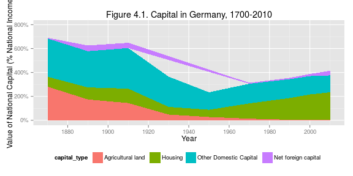 
 
Let's make another function to create the plot for F4.2


run42 = function(tab, num, country){
fdat <- tab[, c("year","public_ass", "public_debt")]
names(fdat) <- c("year", "Public Assets", "Public Debt")
fdat <- melt(fdat, id.var="year")
names(fdat) <- c("year", "Capital", "percent")
 
qplot(year, percent, data=fdat, geom=c("line", "point"), colour = Capital, xlab= "Year", ylab= "Public assets and debt (% national income)") + scale_y_continuous(labels = percent, limits = c(0, 2.5), oob = squish) + 
  ggtitle(paste0("Figure ", num, ". Public wealth in ", country, ", 1700-2010")) + theme(legend.position=c(0.5, .8), legend.background = element_rect(fill="transparent")) + scale_x_continuous(breaks = seq(1700, 2020, by=20))
}

 


run42(tab, "4.2", "Germany")


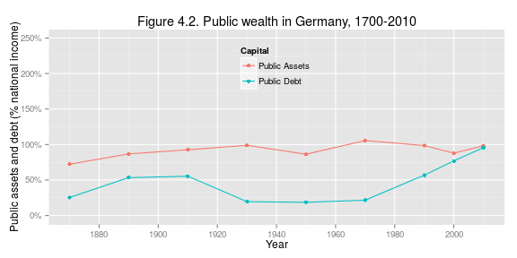 
 
 


run43 = function(tab, num, country){
fdat <- tab[, c("year","nat", "public", "private")]
names(fdat) <- c("year", "National Capital (Public + Private)", "Public", "Private")
fdat <- melt(fdat, id.var="year")
names(fdat) <- c("year", "Capital_Type", "percent")
 
qplot(year, percent, data=fdat, geom=c("line", "point"), colour = Capital_Type, xlab= "Year", ylab= "National, private and public capital (% national income)") + scale_y_continuous(labels = percent, limits = c(-2, 9)) + 
  ggtitle(paste0("Figure ", num, ". Private and public capital in ", country, ", 1700-2010")) + theme(legend.position=c(0.75, .75), legend.background = element_rect(fill="transparent")) + scale_x_continuous(breaks = seq(1700, 2020, by=20))
}

 


run43(tab, "4.3", "Germany")


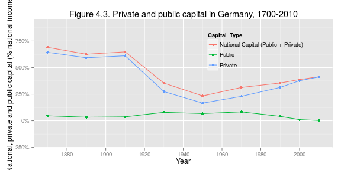 
 
 
## Figures 4.4 and 4.5 - Europe
 
These figures are based on Table TS4.5. Here we read
data from the excel file and name the data series.
 
According to the table:
> Source: Links to PZ 2013  frozen on 2-8-2013
 


## Table TS4.5
tab45 = read.xlsx("../_data/Chapter4TablesFigures.xlsx",sheetName="TS4.5",rowIndex=6:20,colIndex=1:16,header=FALSE)
countries = c("USA", "Germany", "France", "UK", "Europe")
types = c("Private", "National", "Public")
cn = c(sapply(types, paste, countries, sep="_"))
names(tab45) =  c("year", cn)
long45 = melt(tab45 ,id.vars="year")
long45$Capital = gsub("(.*)_(.*)", "\\1", long45$variable)
long45$Country = gsub("(.*)_(.*)", "\\2", long45$variable)
long45$variable = NULL
long45$Country = factor(long45$Country, levels = countries)

 
### Figure 4.4
 


l3 = long45[ long45$Country %in% c("Germany", "France", "UK"), ]
l3 = l3[ l3$Capital %in% c("Public", "Private"),]
num = "4.4"
country = "Europe"
 qplot(year, value, data=l3, geom=c("line"), colour = Country, shape = Capital, xlab="Year", ylab= "Public and private capital (% national income)") + scale_y_continuous(labels = percent, limits = c(-2, 8)) + 
   ggtitle(paste0("Figure ", num, ". Private and public capital in ", country, ", 1870-2010")) + theme(legend.position=c(0.25, .55), legend.background = element_rect(fill="transparent")) + scale_x_continuous(breaks = seq(1700, 2020, by=20)) 


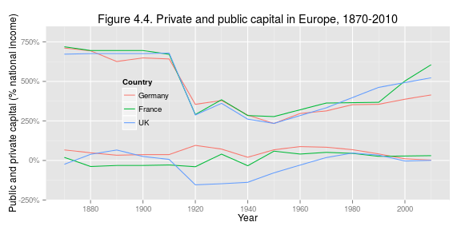 
 
Or we could visualize the countries this faceted by private or public capital


p = ggplot(data = l3, aes(x = year, y=value)) + xlab("Year") + ylab( "Public and private capital (% national income)") + 
  scale_y_continuous(labels = percent, limits = c(-2, 8)) + 
  ggtitle(paste0("Figure ", num, ". Private and public capital in ", country, ", 1870-2010")) + 
  theme(legend.position=c(0.6, .8), legend.background = element_rect(fill="transparent")) + 
  scale_x_continuous(breaks = seq(1700, 2020, by=20)) 
 
p + geom_line(aes(colour=Country)) + facet_wrap(~ Capital)


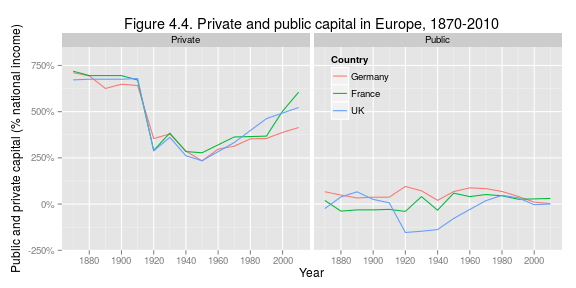 
 
or colored by capital and faceted by country


p + geom_line(aes(colour=Capital)) + facet_wrap(~ Country)


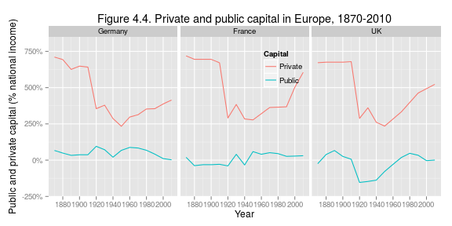 
 
### Figure 4.5
 
I kept the last vertical axes the same for comparison.  


l3 = long45[ long45$Country %in% c("Germany", "France", "UK"), ]
l3 = l3[ l3$Capital %in% c("National"),]
num = "4.5"
country = "Europe"
p45 = qplot(year, value, data=l3, geom=c("line"), colour = Country, shape = Capital, xlab="Year", ylab= "Value of national capital (% national income)") + 
   ggtitle(paste0("Figure ", num, ". National capital in ", country, ", 1870-2010")) + theme(legend.position=c(0.25, .55), legend.background = element_rect(fill="transparent")) + scale_x_continuous(breaks = seq(1700, 2020, by=20)) 
p45 + scale_y_continuous(labels = percent, limits = c(-2, 8))


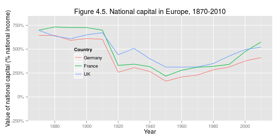 
 
Piketty chose a different axis:
 


p45 + scale_y_continuous(labels = percent, limits = c(1, 8))


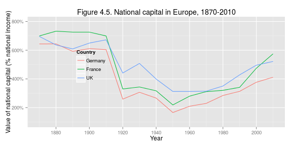 
 
 
## Figure 4.6, 4.7, and 4.8
 
 
These figures are based on Table TS4.2. Here we read
data from the excel file and name the data series.
 


## Table TS4.2
tab42 = read.xlsx("../_data/Chapter4TablesFigures.xlsx",sheetName="TS4.2",rowIndex=11:21,colIndex=1:15,header=FALSE)
names(tab42) =  c("year","nat","nat_land", "nat_house", "nat_dom", "nat_foreign", "public", "public_ass", "public_debt", "private", "slaves", "nat_cap_slaves")

 
The caption of the table lists the sources for this table
as 
 
> Source: Piketty-Zucman 2013, USA.xls, links frozen on 01-24-2013.           
 
 
### Figure 4.6
 


run41(tab42, num = "4.6", "United States")



## Warning: Removed 7 rows containing missing values (position_stack).



## ymax not defined: adjusting position using y instead


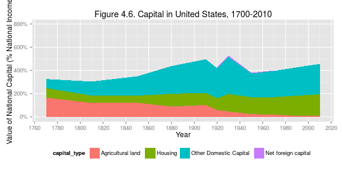 
 
 
The negative values get masked, so let's do some lines to show the ovarlap:
 


run_lines = function(tab, num, country){
  wide42 = tab[,c("nat_land", "nat_house", "nat_dom", "nat_foreign")]
  wide42 = data.frame(t(apply(wide42, 1, cumsum)))
  wide42$year = tab$year
  colnames(wide42) = gsub("nat_", "", colnames(wide42))
  long42 = melt(wide42, id.vars="year")
  long42 = rename(long42, c("variable"="Capital_Type"))
  long42$Capital_Type = revalue(long42$Capital_Type, 
                                c(land="Agricultural land",
                                  house="Housing", 
                                  dom="Other Domestic Capital", 
                                  foreign="Net foreign capital"))
  
  qplot(data = long42, x=year, y=value, colour=Capital_Type, geom="line", xlab= "Year", ylab= "Value of National Capital (% National Income)") + scale_y_continuous(labels = percent, limits = c(0, 8)) +     ggtitle(paste0("Figure ", num, ". Capital in ", country, ", 1700-2010")) + theme(legend.position=c(.8, .8), legend.background = element_rect(fill="transparent")) + scale_x_continuous(breaks = seq(1700, 2020, by=20))
}
run_lines(tab42, 4.6, "United States")


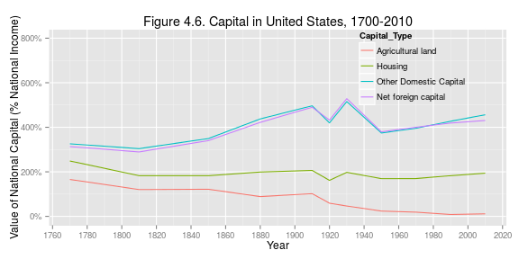 
 
 
### Figure 4.7


run42(tab42, num = "4.7", "United States")


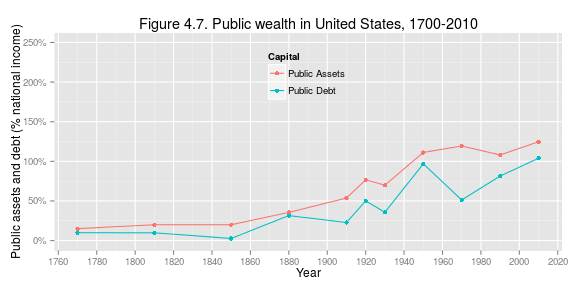 
 
### Figure 4.8
 


run43(tab42, "4.8", "United States")


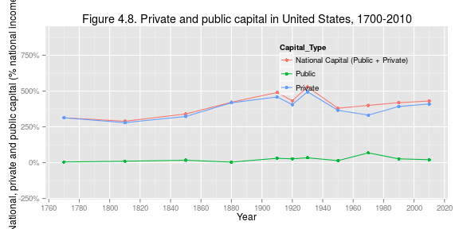 
 
 
## Figure 4.9, FS4.1, FS4.2
 
 
These figures are based on Table TS4.3. Here we read
data from the excel file and name the data series.
 


## Table TS4.3
tab43 = read.xlsx("../_data/Chapter4TablesFigures.xlsx",sheetName="TS4.3",rowIndex=9:18,colIndex=1:14,header=FALSE)
names(tab43) =  c("year","nat","nat_land", "nat_house", "nat_dom", "nat_foreign", "public", "public_ass", "public_debt", "private", "private_land", "private_land_house", "private_land_house_other", "private_foreign")

 
The caption of the table lists the sources for this table
as 
 
> Source: Piketty-Zucman 2013, Canada.xls, links frozen on 24-01-2013   				
 
### Figure 4.9
 


run41(tab43, num = "4.9", "Canada")



## Warning: Removed 10 rows containing missing values (position_stack).



## ymax not defined: adjusting position using y instead


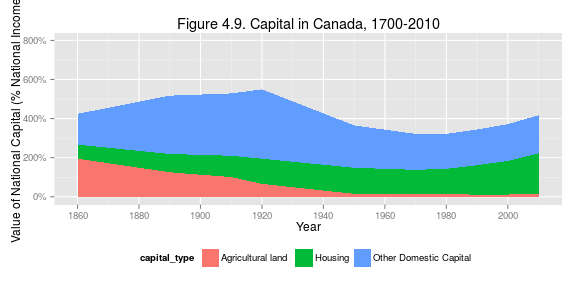 
 
But the foreign capital is actually negative, so it is blocked out.
 
Let's again look at lines
 


run_lines(tab43, num = "4.9", "Canada")


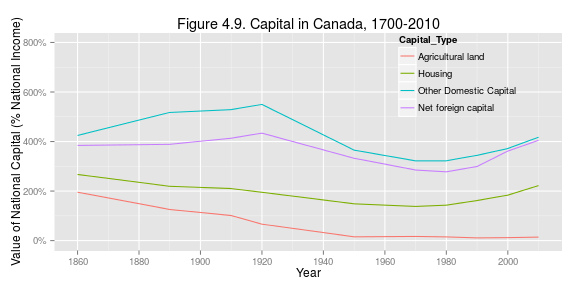 
 
 
### Figure FS4.1
 


run42(tab43, num = "S4.1", "Canada")


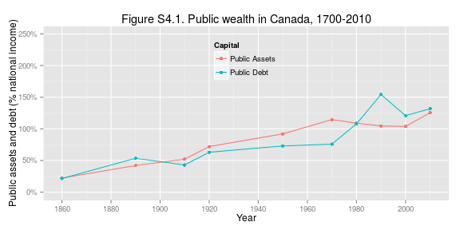 
 
 
### Figure FS4.2
 


run43(tab43, num = "S4.1", "Canada")


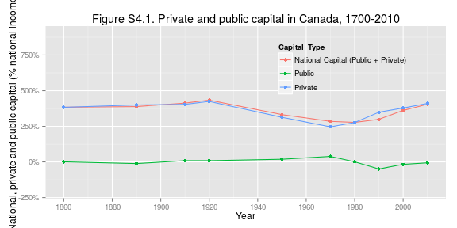 
 
 
## Figure 4.10
 
This figure is similar to 4.6 but has slavery included.
 


num = "4.10"
country = "United States"
  fdat <- tab42[,c("year","nat_land", "slaves", "nat_house", "nat_dom", "nat_foreign")]
  names(fdat) <- c("year","Agricultural land", "Slavery" ,"Housing", "Other Domestic Capital", "Net foreign capital")
  
  # Make the data long for stacking
  fdat <- melt(fdat, id.var="year")
  names(fdat) <- c("year","capital_type","percent")
  
  qplot(year, percent, data=fdat, geom="ribbon", position = "stack", 
        fill = capital_type, xlab= "Year", ylab= "Value of National Capital (% National Income)") + scale_y_continuous(labels = percent, limits = c(0, 8)) + 
    ggtitle(paste0("Figure ", num, ". Capital in ", country, ", 1700-2010")) + theme(legend.position="bottom", legend.background = element_rect(fill="transparent")) + scale_x_continuous(breaks = seq(1700, 2020, by=20))



## Warning: Removed 7 rows containing missing values (position_stack).



## ymax not defined: adjusting position using y instead


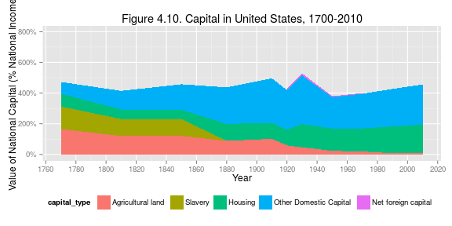 
 
and with lines instead of filled in:
 


  wide42 = tab42[,c("nat_land", "slaves", "nat_house", "nat_dom", "nat_foreign")]
  wide42 = data.frame(t(apply(wide42, 1, cumsum)))
  wide42$year = tab42$year
  colnames(wide42) = gsub("nat_", "", colnames(wide42))
  long42 = melt(wide42, id.vars="year")
  long42 = rename(long42, c("variable"="Capital_Type"))
  noslaves = tab42$year[ tab42$slaves == 0]  
  long42 = long42[ !(long42$year > 1880 & long42$Capital_Type  == "slaves"), ]  
 
  long42$Capital_Type = revalue(long42$Capital_Type, 
                                c(land="Agricultural land",
                                  slaves="Slaves",
                                  house="Housing", 
                                  dom="Other Domestic Capital", 
                                  foreign="Net foreign capital"))
 
  qplot(data = long42, x=year, y=value, colour=Capital_Type, geom="line", xlab= "Year", ylab= "Value of National Capital (% National Income)") + scale_y_continuous(labels = percent, limits = c(0, 8)) +     ggtitle(paste0("Figure ", num, ". Capital in ", country, ", 1700-2010")) + theme(legend.position=c(.82, .78), legend.background = element_rect(fill="transparent")) + scale_x_continuous(breaks = seq(1700, 2020, by=20))


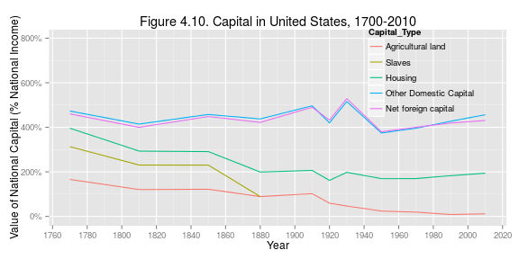 
 
## Figure 4.11
 
This figure are based on Table TS4.4. Here we read
data from the excel file and name the data series.
 


## Table TS4.4
tab44 = read.xlsx("../_data/Chapter4TablesFigures.xlsx",sheetName="TS4.4",rowIndex=9:12,colIndex=1:7,header=FALSE)
names(tab44) =  c("country","nat","nat_land", "slaves", "nat_house", "nat_dom", "nat_foreign")

 
 
The caption of the table lists the sources for this table
as 
 
> Source: UK, France: links to Tables TS3.1, TS3.2 frozen on 2-8-13.
UK, France: links to Tables TS3.1, TS3.2 frozen on 2-8-13.
(UK: average 1750-1810; France 1780)	(UK: moyenne 1750-1810; France 1780)
 


## Table TS4.4
l44 <- tab44[,c("country","nat_land", "slaves", "nat_house", "nat_dom")]
names(l44) <- c("Country","Agricultural land", "Slavery" ,"Housing", "Other Domestic Capital")
num = "4.11"
l44 = melt(l44, id.vars="Country")
l44$Country = factor(l44$Country, levels = tab44$country)
qplot(y=value, x=Country, fill = variable,  data=l44) + geom_bar( stat = "identity", xlab= "") + scale_y_continuous(labels = percent, limits = c(0, 8)) + ggtitle("Figure 4.11. Capital around 1770-1810: Old an New World") + theme(legend.position=c(.89, .7), legend.background = element_rect(fill="transparent")) + scale_fill_discrete(guide=  guide_legend(reverse = TRUE,  title=NULL)) + ylab("Value of National Capital (% National Income)")


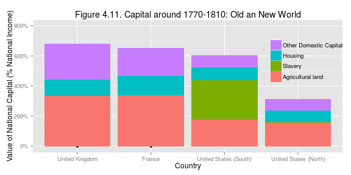 
 
