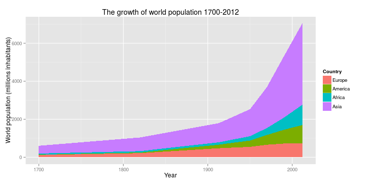
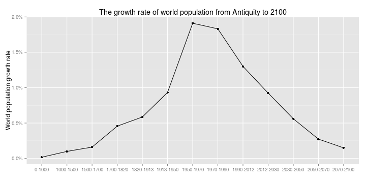
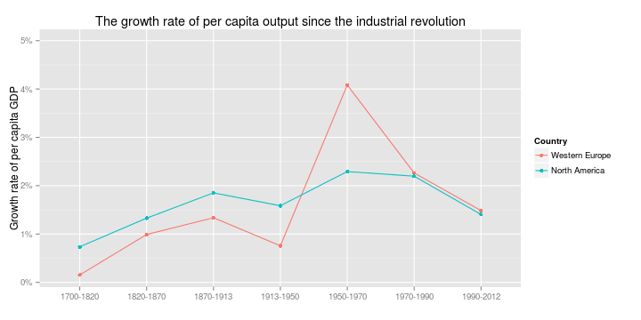
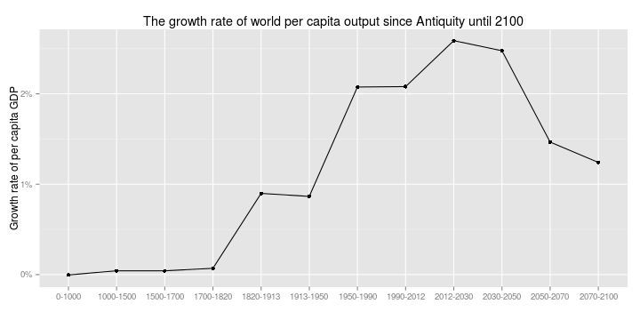
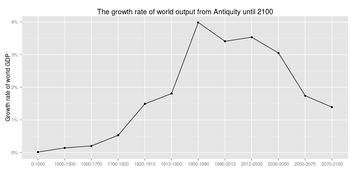
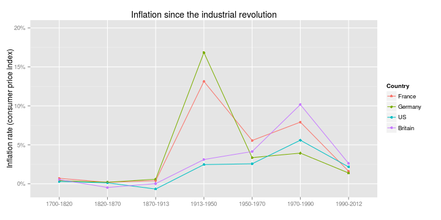

Capital in the 21st Century: Chapter 2
========================================================
 
### Data provenance
 
The data were downloaded as Excel files from: http://piketty.pse.ens.fr/en/capital21c2.
 
### Loading relevant libraries and data
 
This document depends on the [xlsx](http://cran.r-project.org/web/packages/xlsx/index.html), [reshape2](http://cran.r-project.org/web/packages/reshape2/index.html), [ggplot2](http://cran.r-project.org/web/packages/ggplot2/index.html), and [scales](http://cran.r-project.org/web/packages/scales/index.html) packages.
 
 


library(ggplot2)
library(xlsx)
library(reshape2)
library(scales)
 
## Table TS2.1
 
ts21 = read.xlsx("../_data/Chapter2TablesFigures.xlsx",sheetName="TS2.2",rowIndex=8:17,colIndex=c(25,27:30),header=FALSE)
names(ts21) = c("year","Europe","America","Africa","Asia")
ts21 = melt(ts21,id.vars="year")
names(ts21) = c("year","Country","population")
 
 
## Table TS2.2
 
ts22 = read.xlsx("../_data/Chapter2TablesFigures.xlsx",sheetName="TS2.2",rowIndex=8:20,colIndex=8:9,header=FALSE)
ts22[,3] = 1:13
names(ts22) = c("period","growth","order")
 
 
## Table TS2.3
 
ts23 = read.xlsx("../_data/Chapter2TablesFigures.xlsx",sheetName="TS2.4",rowIndex=10:16,colIndex=4:6,header=FALSE)
names(ts23) = c("period","Western Europe","North America")
ts23 = melt(ts23,id.vars="period")
ts23[,4] = rep(1:7,2)
names(ts23) = c("period","Country","growth","order")
 
 
## Table TS2.4
 
ts24 = read.xlsx("../_data/Chapter2TablesFigures.xlsx",sheetName="TS2.4",rowIndex=7:18,colIndex=c(1,3),header=FALSE)
ts24[,3] = 1:12
names(ts24) = c("period","growth","order")
 
 
## Table TS2.5
 
ts25 = read.xlsx("../_data/Chapter2TablesFigures.xlsx",sheetName="TS2.4",rowIndex=7:18,colIndex=c(1,2),header=FALSE)
ts25[,3] = 1:12
names(ts25) = c("period","growth","order")
 
 
## Table TS2.6
 
ts26 = read.xlsx("../_data/Chapter2TablesFigures.xlsx",sheetName="TS2.5",rowIndex=8:14,colIndex=1:5,header=FALSE)
names(ts26) = c("period","France","Germany","US","Britain")
ts26 = melt(ts26,id.vars="period")
ts26[,4] = rep(1:7,4)
names(ts26) = c("period","Country","Inflation","order")

 
 
## Make Figure 2.1
 
This code remakes Figure 2.1. Note that in the figure in the Excel tables, the x-axis is not evenly spaced, so the figure looks different. 
 


qplot(year,population,data=ts21,geom="area",fill=Country,xlim=c(1700,2012),xlab="Year",ylab="World population (millions inhabitants)",main="The growth of world population 1700-2012")



## Warning: Removed 12 rows containing missing values (position_stack).


 
 
## Make Figure 2.2


qplot(order,growth,data=ts22,geom=c("point","line"),ylab="World population growth rate",main="The growth rate of world population from Antiquity to 2100")+
  scale_x_discrete("",labels=ts22$period)+
  scale_y_continuous(labels=percent)


 
 
## Make Figure 2.3
 


qplot(order,growth,data=ts23,geom=c("point","line"),colour=Country,ymax=.05,ylab="Growth rate of per capita GDP",main="The growth rate of per capita output since the industrial revolution")+
  scale_x_discrete("",labels=ts23$period)+
  scale_y_continuous(labels=percent)


 
 
## Make Figure 2.4
 


qplot(order,growth,data=ts24,geom=c("point","line"),ylab="Growth rate of per capita GDP",main="The growth rate of world per capita output since Antiquity until 2100")+
  scale_x_discrete("",labels=ts24$period)+
  scale_y_continuous(labels=percent)


 
 
## Make Figure 2.5
 


qplot(order,growth,data=ts25,geom=c("point","line"),ylab="Growth rate of world GDP",main="The growth rate of world output from Antiquity until 2100")+
  scale_x_discrete("",labels=ts25$period)+
  scale_y_continuous(labels=percent)


 
 
## Make Figure 2.6
 


qplot(order,Inflation,data=ts26,geom=c("point","line"),colour=Country,ymax=.20,ylab="Inflation rate (consumer price index)",main="Inflation since the industrial revolution")+
  scale_x_discrete("",labels=ts26$period)+
  scale_y_continuous(labels=percent)


 
