Capital in the 21st Century: Chapter 1
========================================================
 
### Data provenance
 
The data were downloaded as Excel files from: http://piketty.pse.ens.fr/en/capital21c2. 
 
### Loading libraries and data for Figures F1.1 and FS1.1
 
This document depends on the [xlsx](http://cran.r-project.org/web/packages/xlsx/index.html) package.
 


library(xlsx)
 
fig1s1_dat = read.xlsx(
    "../_data/Chapter1TablesFigures.xlsx", 
    sheetName="TS1.1a", rowIndex=7:18, colIndex=c(1,3:6), header=TRUE)
names(fig1s1_dat)[1] = "Year" 
fig1s1_dat$EAm = fig1s1_dat$Europe+fig1s1_dat$America
fig1s1_dat$EAmAf = fig1s1_dat$EAm+fig1s1_dat$Africa

 
Here's a custom ribbon plot function, since this type of figure is created several times, and a vector of ggplot2-approved, colorblind-friendly colors:
 


myRibbonPlot = function(dat, xlim=NULL, even_axis=FALSE, xlab='Year', ylab){
    stopifnot(all(c("Year", "Europe", "EAm", "EAmAf") %in% names(dat))) 
    # this is a very specific function :) 
    if(even_axis){
        xcoords = c(1:nrow(dat), nrow(dat):1)
        xaxtype = 'n'
        if(!is.null(xlim)){
            xlim = match(xlim, dat$Year)
        }
    }else{
        xcoords = c(dat$Year, rev(dat$Year))
        xaxtype = NULL
    }
    plot(xcoords[1:(length(xcoords)/2)], rep(0, nrow(dat)), 
        type='n', ylim=c(0,1), xlab=xlab, ylab=ylab, xaxt=xaxtype, 
        xlim=xlim)
    polygon(x=xcoords, y=c(rep(0, nrow(dat)), rev(dat$Europe)), col=cbPalette[2])
    polygon(x=xcoords, y=c(dat$Europe, rev(dat$EAm)), col=cbPalette[3])
    polygon(x=xcoords, y=c(dat$EAm, rev(dat$EAmAf)), col=cbPalette[5])
    polygon(x=xcoords, y=c(dat$EAmAf, rep(1, nrow(dat))), col=cbPalette[1])
    if(even_axis){
        axis(side=1, at=xcoords[1:(length(xcoords)/2)], labels=dat$Year)
    }
}
 
cbPalette <- c("#999999", "#E69F00", "#56B4E9", "#009E73", "#F0E442", 
    "#0072B2", "#D55E00", "#CC79A7") 

 
## Figure F1.1
 
This code remakes Figure F1.1, scaling time on the x-axis linearly:
 


myRibbonPlot(fig1s1_dat, xlim=c(1700, 2012), ylab="World Output")
text(1950, 0.9, 'Asia')
text(1950, 0.764, 'Africa')
text(1950, 0.55, 'America')
text(1950, 0.2, 'Europe')
title("F1.1: World Output, 1700-2012 (linear time scale)")


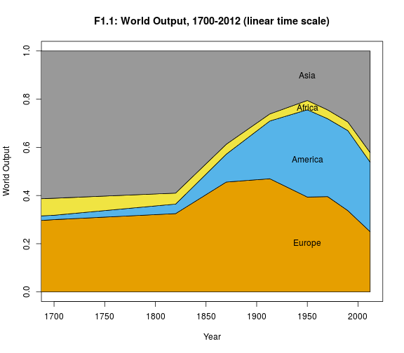 
 
This code remakes Figure F1.1 as it appears in the original analysis: data points on the x-axis are equally spaced, no matter how far apart in time they are:
 


myRibbonPlot(fig1s1_dat, xlim=c(1700, 2012), even_axis=TRUE, ylab='World Output')
text(8, 0.9, 'Asia')
text(8, 0.764, 'Africa')
text(8, 0.55, 'America')
text(8, 0.2, 'Europe')
title("F1.1: World Output, 1700-2012 (original x-axis)")


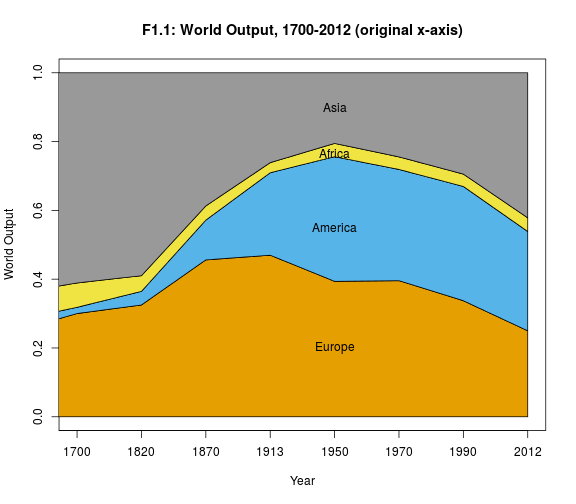 
 
## Figure FS1.1
 
This code remakes Figure FS1.1, scaling time on the x-axis linearly:
 


myRibbonPlot(fig1s1_dat, ylab='World Output')
text(1000, 0.6, 'Asia')
text(1000, 0.24, 'Africa')
text(1000, 0.16, 'America')
text(1000, 0.07, 'Europe')
title("FS1.1: Distribution of World Output, 0-2012 (linear time scale)")


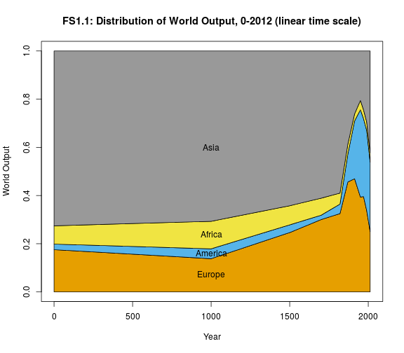 
 
And this code remakes Figure FS1.1, scaling time as it was scaled in the original figure:
 


myRibbonPlot(fig1s1_dat, ylab='World Output', even_axis=TRUE)
text(8, 0.9, 'Asia')
text(8, 0.764, 'Africa')
text(8, 0.55, 'America')
text(8, 0.2, 'Europe')
title("FS1.1: Distribution of World Output, 0-2012 (original x-axis)")


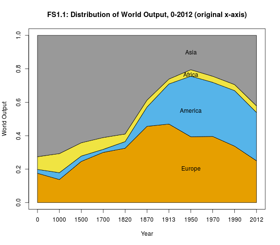 
 
### Loading data for figures F1.2 and SF1.2
 


fig2s2_dat = read.xlsx(
    "../_data/Chapter1TablesFigures.xlsx", 
    sheetName="TS1.2", rowIndex=7:18, colIndex=c(1,3:6), header=TRUE)
names(fig2s2_dat)[1] = "Year" 
fig2s2_dat$EAm = fig2s2_dat$Europe+fig2s2_dat$America
fig2s2_dat$EAmAf = fig2s2_dat$EAm+fig2s2_dat$Africa

 
## Figure F1.2
 
Here is code to re-make Figure F1.2, with time scaled linearly on the x-axis:
 


myRibbonPlot(dat=fig2s2_dat, ylab="Percent of World Population", xlim=c(1700, 2012))
text(1900, 0.75, 'Asia')
text(1900, 0.385, 'Africa')
text(1900, 0.3, 'America')
text(1900, 0.15, 'Europe')
title("F1.2: World Population Distribution, 1700-2012 (linear time scale)")


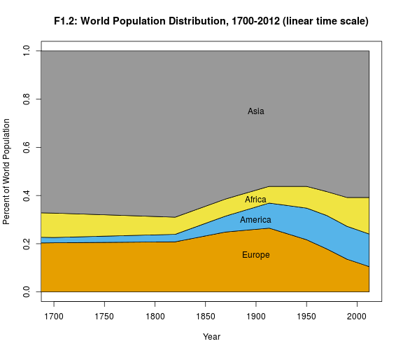 
 
And here is code to re-make Figure F1.2 with the x-axis scaled as it was in the original analysis (equal spacing between each year with data):
 


myRibbonPlot(dat=fig2s2_dat, even_axis=TRUE, ylab='Percent of World Population', xlim=c(1700, 2012))
text(7, 0.75, 'Asia')
text(7, 0.4, 'Africa')
text(7, 0.3, 'America')
text(7, 0.15, 'Europe')
title("F1.2: World Population Distribution, 1700-2012 (original time scale)")


 
 
## Figure FS1.2
 
This code recreates figure FS1.2, scaling time linearly on the x-axis:
 


myRibbonPlot(dat=fig2s2_dat, ylab="Percent of World Population")
text(1000, 0.6, 'Asia')
text(1000, 0.25, 'Africa')
text(1000, 0.17, 'America')
text(1000, 0.075, 'Europe')
title("FS1.2: World Population Distribution, 0-2012 (linear time scale)")


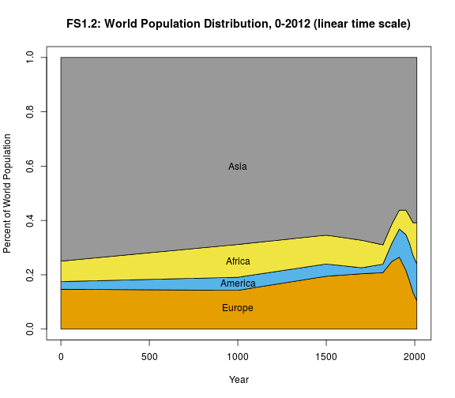 
 
And this code recreates figure FS1.2, with the x-axis scaled as it was in the original analysis:
 


myRibbonPlot(dat=fig2s2_dat, ylab="Percent of World Population", even_axis=TRUE)
text(7, 0.75, 'Asia')
text(7, 0.39, 'Africa')
text(7, 0.3, 'America')
text(7, 0.14, 'Europe')
title("FS1.2: World Population Distribution, 0-2012 (original time scale)")


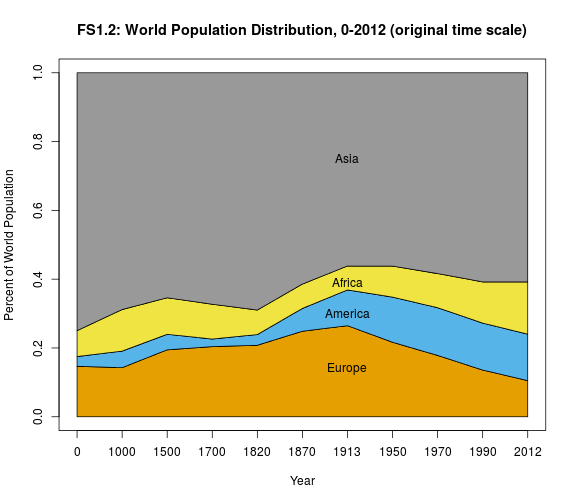 
 
 
### Loading data for Figures F1.3 and FS1.3
 


fig3s3_dat = read.xlsx(
    "../_data/Chapter1TablesFigures.xlsx", 
    sheetName="TS1.3", rowIndex=7:18, colIndex=c(1:8), header=TRUE)
names(fig3s3_dat)[c(1,2,4,7,8)] = c("Year", "World", "America", "EuropeAmerica", "AsiaAfrica")
fig3s3_dat[2:8] = 100*fig3s3_dat[2:8]

 
## Figure F1.3
 
This code reproduces Figure F1.3, scaling the x-axis linearly with time:
 


xcoords = fig3s3_dat$Year[4:11]
plot(xcoords, fig3s3_dat$World[4:11], ylim=c(0,250), xlim=c(1700,2012), xlab="Year", ylab="Per capita GDP as % of world average",col=cbPalette[3], pch=19, lwd=2, type='o')
grid()
lines(xcoords, fig3s3_dat$EuropeAmerica[4:11], col=cbPalette[4], lwd=2, type='o', pch=19)
lines(xcoords, fig3s3_dat$AsiaAfrica[4:11], col=cbPalette[7], lwd=2, pch=19, type='o')
title("F1.3: Global inequality, 1700-2012 (linear time scale)")


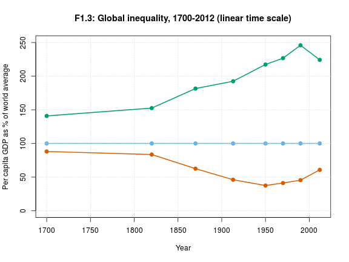 
 
And here is the code for Figure F1.3 with an x-axis scaled as it is in the original analysis (equally spaced between years with data):
 


xcoords = 1:8
plot(xcoords, fig3s3_dat$World[4:11], ylim=c(0,250), xlab="Year", ylab="Per capita GDP as % of world average",col=cbPalette[3], pch=19, xaxt='n', type='o', lwd=2)
grid()
axis(side=1, at=1:8, labels=fig3s3_dat$Year[4:11])
lines(xcoords, fig3s3_dat$EuropeAmerica[4:11], col=cbPalette[4], lwd=2, pch=19, type='o')
lines(xcoords, fig3s3_dat$AsiaAfrica[4:11], col=cbPalette[7], lwd=2, pch=19, type='o')
title("F1.3: Global inequality, 1700-2012 (original time scale)")


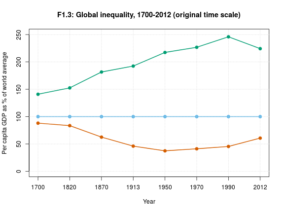 
 
## Figure FS1.3
 
This code reproduces Figure SF1.3, with time scaled linearly on the x-axis:
 


xcoords = fig3s3_dat$Year
plot(xcoords, fig3s3_dat$World, ylim=c(0,250), xlab="Year", ylab="Per capita GDP as % of world average",col=cbPalette[3], pch=19, lwd=2, type='o')
grid()
lines(xcoords, fig3s3_dat$EuropeAmerica, col=cbPalette[4], lwd=2, pch=19, type='o')
lines(xcoords, fig3s3_dat$AsiaAfrica, col=cbPalette[7], lwd=2, pch=19, type='o')
title("FS1.3: Global inequality, 0-2012 (linear time scale)")


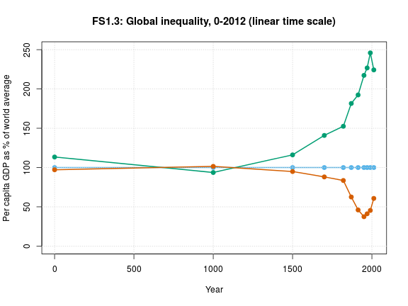 
 
And this code reproduces Figure SF1.3 with the time points evenly spaced on the x-axis, as they are in the original analysis:
 


xcoords = 1:11
plot(xcoords, fig3s3_dat$World, ylim=c(0,250), xlab="Year", ylab="Per capita GDP as % of world average",col=cbPalette[3], pch=19, xaxt='n', type='o', lwd=2)
grid()
axis(side=1, at=1:11, labels=fig3s3_dat$Year)
lines(xcoords, fig3s3_dat$EuropeAmerica, col=cbPalette[4], lwd=2, pch=19, type='o')
lines(xcoords, fig3s3_dat$AsiaAfrica, col=cbPalette[7], lwd=2, pch=19, type='o')
title("FS1.3: Global inequality, 1700-2012 (original time scale)")


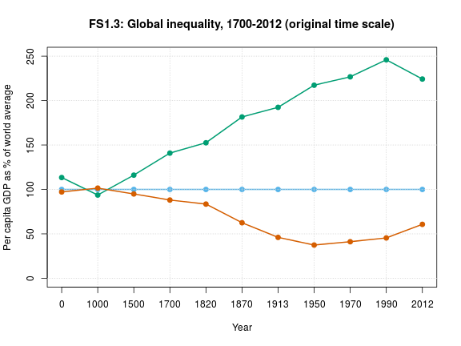 
 
Finally, here is a plot of the Europe/America and Africa/Asia per capita GDPs as a percentage of world income, _separately_, compared to the overall region per capita GDP as percentage of world income. These show that Europe seems to have more influence on the Europe/America combined figure than America does, and Asia seems to have more influence on the Asia/Africa combined figure than Africa does.
 


par(mfrow=c(1,2))
plot(1:nrow(fig3s3_dat), fig3s3_dat$Europe, type='o', pch=19, ylim=c(20, 280), xlab='Year', xaxt='n', ylab='Per capita GDP as % of world average', main='Europe/America')
axis(side=1, at=1:11, labels=fig3s3_dat$Year)
lines(1:11, fig3s3_dat$America, type='o', pch=19, lwd=2, col='gray')
lines(1:11, fig3s3_dat$EuropeAmerica, type='o', pch=19, lwd=2, col='dodgerblue')
legend('topleft', pch=c(19,19,19), col=c('black', 'gray', 'dodgerblue'), c('Europe', 'America', 'combined'))
plot(1:nrow(fig3s3_dat), fig3s3_dat$Africa, type='o', pch=19, ylim=c(20, 280), col='gray', xaxt='n', xlab='Year', ylab='Per capita GDP as % of world average', main='Asia/Africa')
axis(side=1, at=1:11, labels=fig3s3_dat$Year)
lines(1:11, fig3s3_dat$Asia, type='o', pch=19, lwd=2)
lines(1:11, fig3s3_dat$AsiaAfrica, type='o', pch=19, lwd=2, col='green3')
legend('topleft', pch=c(19,19,19), col=c('black', 'gray', 'green3'), c('Asia', 'Africa', 'combined'))


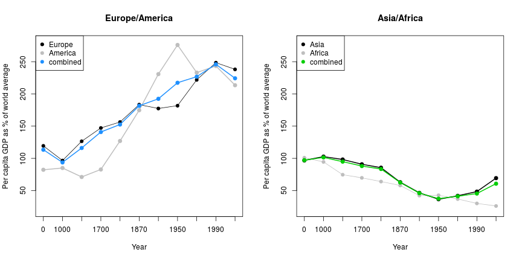 
 
### load data for Figures F1.4, F1.5, FS1.4(ab) and FS1.5(abc)


fig45_dat = read.xlsx(
    "../_data/Chapter1TablesFigures.xlsx", 
    sheetName="TS1.7", rowIndex=7:30, colIndex=c(1:9, 17:22), header=TRUE)
names(fig45_dat)[1] = 'Year'

 
## Figure F1.4
 
Here is code that recreates Figure F1.4. The figure is labeled with "Euro/dollar", but the y-axis labeling (in dollars) indicates that the data presented is "dollars per Euro", i.e., the exchange rate in 2012 is $1.30 per 1 Euro, and the purchasing power parity is $1.20 per 1 Euro.
 


plot(fig45_dat$Year, fig45_dat$exchange.rate.euro.dollar, xlab='Year',
    ylab='rate/parity, in dollars per 1 euro', type='o', col=cbPalette[4],
    lwd=2, pch=19)
lines(fig45_dat$Year, fig45_dat$purchasing.power.parity.euro.dollar, type='o', col=cbPalette[7], pch=19, lwd=2)
grid()
legend('topleft', pch=c(19,19), col=c(cbPalette[4], cbPalette[7]), 
    c('Exchange Rate (dollars per 1 euro)', 'Purchasing Power Parity (dollars per 1 euro)'))
title('F1.4: Exchange rate and purchasing power parity, euros & dollars')


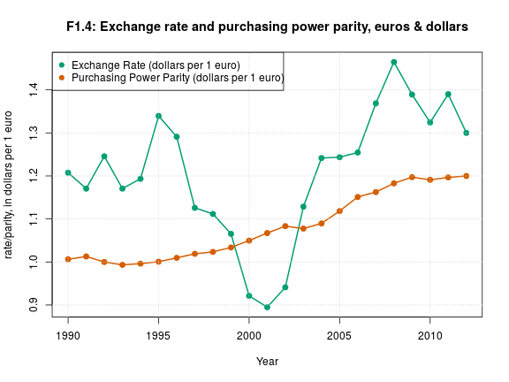 
 
## Figure FS1.4a
 
This code remakes Figure FS1.4a.
 


plot(fig45_dat$Year, fig45_dat$exchange.rate.euro.rupee, xlab='Year',
    ylab='rate/parity, in rupees per 1 euro', type='o', col=cbPalette[4],
    lwd=2, pch=19, ylim=c(0, 70))
grid()
lines(fig45_dat$Year, fig45_dat$purchasing.power.parity.euro.rupee, type='o', col=cbPalette[7], pch=19, lwd=2)
legend('topleft', pch=c(19,19), col=c(cbPalette[4], cbPalette[7]), 
    c('Exchange Rate (rupees per 1 euro)', 'Purchasing Power Parity (rupees per 1 euro)'))
title('FS1.4a: Exchange rate and purchasing power parity, euros & rupees')


 
 
## Figure FS1.4b
 
This code reproduces Figure FS1.4b.
 


plot(fig45_dat$Year, fig45_dat$exchange.rate.euro.yen, xlab='Year',
    ylab='rate/parity, in yen per 1 euro', type='o', col=cbPalette[4],
    lwd=2, pch=19, ylim=c(90, 200))
grid()
lines(fig45_dat$Year, fig45_dat$purchasing.power.parity.euro.yen, type='o', col=cbPalette[7], pch=19, lwd=2)
legend('topright', pch=c(19,19), col=c(cbPalette[4], cbPalette[7]), 
    c('Exchange Rate (yen per 1 euro)', 'Purchasing Power Parity (yen per 1 euro)'))
title('FS1.4b: Exchange rate and purchasing power parity, euros & yen')


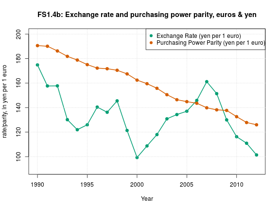 
 
## Figure F1.5
 
This code reproduces Figure F1.5. 
 


plot(fig45_dat$Year, fig45_dat$exchange.rate.euro.yuan, xlab='Year',
    ylab='rate/parity, in yuans per 1 euro', type='o', col=cbPalette[4],
    lwd=2, pch=19, ylim=c(0, 12))
grid()
lines(fig45_dat$Year, fig45_dat$purchasing.power.parity.euro.yuan, type='o', col=cbPalette[7], pch=19, lwd=2)
legend('bottomright', pch=c(19,19), col=c(cbPalette[4], cbPalette[7]), 
    c('Exchange Rate (yuans per 1 euro)', 'Purchasing Power Parity (yuans per 1 euro)'))
title('F1.5: Exchange rate and purchasing power parity, euros & yuans')


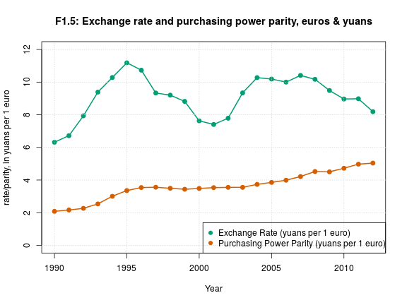 
 
## Figure FS1.5a
 
This code remakes Figure FS1.5a.
 


plot(fig45_dat$Year, fig45_dat$exchange.rate.dollar.yuan., xlab='Year',
    ylab='rate/parity, in yuans per 1 dollar', type='o', col=cbPalette[4],
    lwd=2, pch=19, ylim=c(0, 9))
grid()
lines(fig45_dat$Year, fig45_dat$purchasing.power.parity.dollar.yuan, type='o', col=cbPalette[7], pch=19, lwd=2)
legend('bottomright', pch=c(19,19), col=c(cbPalette[4], cbPalette[7]), 
    c('Exchange Rate (yuans per 1 dollar)', 'Purchasing Power Parity (yuans per 1 dollar)'))
title('FS1.5a: Exchange rate and purchasing power parity, dollars & yuans')


 
 
## Figure FS1.5b
 
This code remakes Figure FS1.5b.
 


plot(fig45_dat$Year, fig45_dat$exchange.rate.dollar.rupee, xlab='Year',
    ylab='rate/parity, in rupees per 1 dollar', type='o', col=cbPalette[4],
    lwd=2, pch=19, ylim=c(0, 55))
grid()
lines(fig45_dat$Year, fig45_dat$purchasing.power.parity.dollar.rupee, type='o', col=cbPalette[7], pch=19, lwd=2)
legend('bottomright', pch=c(19,19), col=c(cbPalette[4], cbPalette[7]), 
    c('Exchange Rate (rupees per 1 dollar)', 'Purchasing Power Parity (rupees per 1 dollar)'))
title('FS1.5b: Exchange rate and purchasing power parity, dollars & rupees')


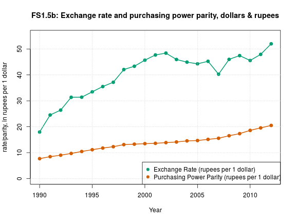 
 
## Figure FS1.5c
 
This code recreates Figure FS1.5c
 


plot(fig45_dat$Year, fig45_dat$exchange.rate.dollar.yen, xlab='Year',
    ylab='rate/parity, in yen per 1 dollar', type='o', col=cbPalette[4],
    lwd=2, pch=19, ylim=c(70, 200))
grid()
lines(fig45_dat$Year, fig45_dat$purchasing.power.parity.dollar.yen, type='o', col=cbPalette[7], pch=19, lwd=2)
legend('topright', pch=c(19,19), col=c(cbPalette[4], cbPalette[7]), 
    c('Exchange Rate (yen per 1 dollar)', 'Purchasing Power Parity (yen per 1 dollar)'))
title('F1.5c: Exchange rate and purchasing power parity, dollars & yen')


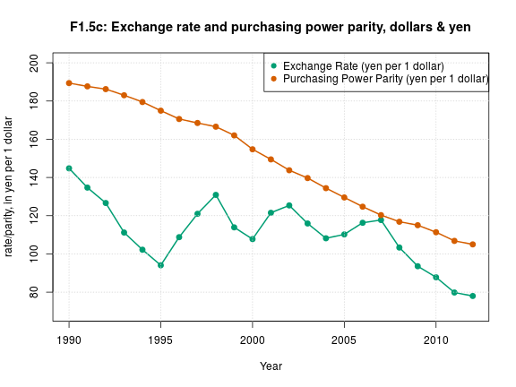 
 
 
